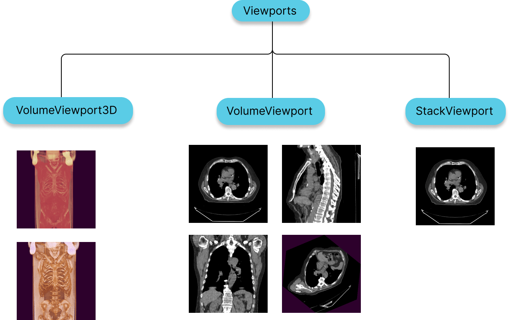

# 视口

视口可以被认为是：

- 从特定角度观看图像的相机。
- 用于显示该相机输出的画布。
- 一组从图像数据到可视数据的转换（LUT、窗口级别、平移等）

在“Cornerstone3D”中，视口是从 HTML 元素创建的，消费者应该传递应为其创建视口的“元素”。例如，CT 系列可以是通过“4-up”视图中的 4 个视口进行查看：轴向 MPR、矢状 MPR、冠状 MPR、3D 透视体渲染。

有关参考的更多详细信息，请参阅[视口参考和演示](./viewportReferencePresentation.md)以及选择哪个图像以及如何呈现该图像的呈现详细信息。

<div style={{textAlign: 'center'}}>



</div>

## StackViewport

- 适合渲染一堆图像，这些图像可能属于也可能不属于同一图像。
- 堆栈可以包含各种形状、大小和方向的 2D 图像

## VolumeViewport

- 适合渲染被视为一幅 3D 图像的体积数据。
- 拥有 VolumeViewport 可通过设计实现多平面重组或重建 (MPR)，您可以在其中从各种不同方向可视化体积，而无需增加性能成本。
- 用于两个系列之间的图像融合

## VolumeViewport3D

- 适用于体积数据的实际 3D 渲染。
- 具有不同类型的预设，例如骨骼、软组织、肺等。

:::note

`StackViewport` 和 `VolumeViewport`、`VolumeViewport3D` 都是通过 `RenderingEngine` API 创建的。
:::

## VideoViewport

-适用于渲染视频数据
-视频可以包括 MPEG 4 编码视频流。理论上也支持MPEG2，但实际上浏览器不支持这一点。

## 整个幻灯片图像视口

- 适合渲染整个幻灯片图像 

## 初始显示区

所有视口都继承自 Viewport 类，该类具有可以提供的“displayArea”字段。
该字段可用于以编程方式设置图像的初始缩放/平移。默认情况下，视口将使 dicom 图像适合屏幕。 `displayArea` 采用 `DisplayArea` 类型，具有以下内容字段。

```js
type DisplayArea = {
  imageArea: [number, number], // areaX, areaY
  imageCanvasPoint: {
    imagePoint: [number, number], // imageX, imageY
    canvasPoint: [number, number], // canvasX, canvasY
  },
  storeAsInitialCamera: boolean,
};
```

缩放和平移均与初始“适合屏幕”视图相关。

为了将图像放大 200%，我们将“imageArea”设置为 [0.5, 0.5]。
平移由提供的“imagePoint”和提供的“canvasPoint”控制。您可以将画布想象成一张白纸，将图像想象成另一张纸，就像胸部 X 光检查一样。用笔在画布上标记一个点，然后在胸部 X 光图上标记另一个点。现在尝试“平移”图像，使“imagePoint”与`画布点`。这就是 imageCanvasPoint 的 API 设计所代表的意义。
因此，如果您想左对齐图像，您可以提供以下值：

```js
imageCanvasPoint: {
  imagePoint: [0, 0.5], // imageX, imageY
  canvasPoint: [0, 0.5], // canvasX, canvasY
};
```

这意味着画布上的左 (0) 中 (0.5) 点需要与图像上的左 (0) 中 (0.5) 点。值基于完整图像的大小百分比。在此示例中，如果我们有一张 1024 x 1024 X 射线图像。 imagePoint 将为 [0, 512]。假设我们使用的是横向模式 (844 x 390) 的 iPhone 手机。 canvasPoint 将为 [0, 195]。