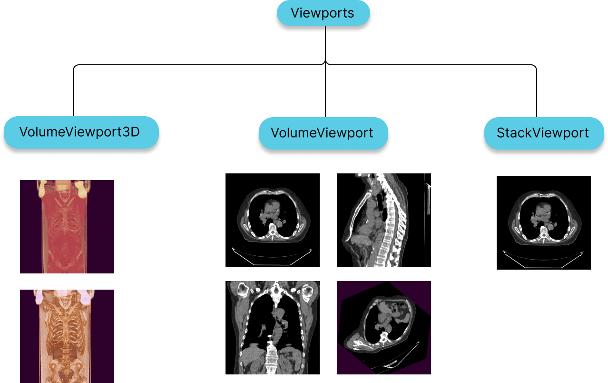

# 视口 {#viewports}

视口可以从三个角度来理解：

- 一台从特定视角观察影像的相机。
- 一块用来显示这台相机输出的画布。
- 一组从影像数据到可视数据的变换（LUT、窗宽窗位、平移等）。

在 `Cornerstone3D` 中，视口是从 HTML 元素创建的，使用方需要传入
要为之创建视口的那个 `element`。举例来说，一套 CT 序列可以用「四宫格」视图、
通过 4 个视口来查看：轴位 MPR、矢状位 MPR、冠状位 MPR，以及一个三维透视体绘制。

关于「选择哪张影像」以及「这张影像如何呈现」的细节，
详见[视图引用与显示状态](./viewportReferencePresentation.md)。

通用视口（Generic / Next）的实现以语义化的 `ViewState` 作为变更的唯一可信来源。
需要跨视口获取平移、缩放、旋转、scale 或渲染器相机输出的代码，
应当使用[视口投影](./generic-viewport/viewport-projection.md)，
而不要在不同视口族之间复制相机对象。

<div style={{textAlign: 'center'}}>



</div>

## StackViewport（堆栈视口） {#stackviewport}

- 适合渲染一组堆栈影像，这些影像可以属于同一份影像，也可以不属于。
- 堆栈中可以包含形状、尺寸和方向各异的二维影像。

## VolumeViewport（体数据视口） {#volumeviewport}

- 适合渲染被视为单个三维影像的体数据。
- 使用体数据视口在设计上就带来了多平面重建（MPR）能力，
  你可以从各种不同方位观察这份体数据，而不会增加额外的性能开销。
- 适合在两个序列之间做影像融合。

## 3D 视口 {#3d-viewport}

- 适合对体数据做真正的三维渲染。
- 适合使用骨、软组织、肺等不同类型的预设。

:::note

`StackViewport`、`VolumeViewport` 和 `VolumeViewport3D` 都通过
`RenderingEngine` API 创建。

:::

## VideoViewport（视频视口） {#videoviewport}

- 适合渲染视频数据。
- 视频可以是 MPEG 4 编码的视频流。理论上 MPEG2 也受支持，
  但实际上浏览器并不支持它。

## 全片影像视口 {#whole-slide-image-viewport}

- 适合渲染全片影像（whole slide image）。

## 初始显示区域 {#initial-display-area}

所有视口都继承自 Viewport 类，该类带有一个可以传入的 `displayArea` 字段。
这个字段可以用来以编程方式设置影像的初始缩放与平移。默认情况下，
视口会把 DICOM 影像适配到屏幕大小。`displayArea` 接受一个 `DisplayArea` 类型，
包含以下字段。

```js
type DisplayArea = {
  imageArea: [number, number], // areaX, areaY
  imageCanvasPoint: {
    imagePoint: [number, number], // imageX, imageY
    canvasPoint: [number, number], // canvasX, canvasY
  },
  storeAsInitialCamera: boolean,
};
```

缩放和平移都是相对于最初那个「适配屏幕」视图而言的。

若要把影像放大到 200%，就把 `imageArea` 设为 `[0.5, 0.5]`。

平移由传入的 `imagePoint` 和 `canvasPoint` 共同控制。你可以把画布想象成一张白纸，
把影像想象成另一张纸（比如一张胸片）。用笔在画布这张纸上标一个点，
再在胸片影像上标另一个点。现在试着「平移」影像，让 `imagePoint`
与 `canvasPoint` 对上——这就是 `imageCanvasPoint` 这个 API 设计所表达的含义。

因此，如果你想让影像左对齐，可以传入下面这组值：

```js
imageCanvasPoint: {
  imagePoint: [0, 0.5], // imageX, imageY
  canvasPoint: [0, 0.5], // canvasX, canvasY
};
```

它的含义是：画布上「最左（0）、垂直居中（0.5）」这个点，
需要与影像上「最左（0）、垂直居中（0.5）」这个点对齐。
取值都是相对于完整影像尺寸的百分比。在这个例子里，
假设有一张 1024 × 1024 的 X 光影像，那么 imagePoint 就是 `[0, 512]`。
再假设我们用的是横屏的 iPhone（844 × 390），那么 canvasPoint 就是 `[0, 195]`。
