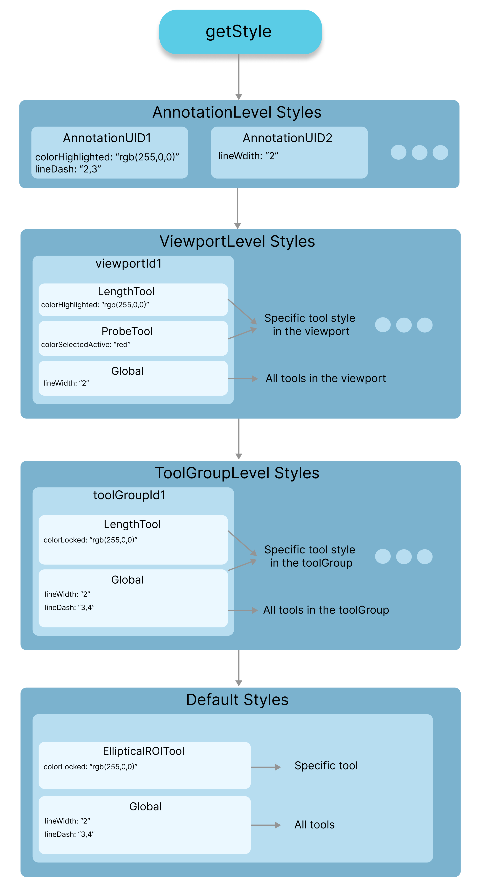

本节介绍修改工具样式的各种方式，包括在 `selected`、`highlighted`、`locked`
等状态下的 `color`，以及文本框颜色、线条虚线样式与粗细等诸多属性。

## 样式层级 {#style-hierarchy}

先从样式层级说起。层级结构如下：

- 标注级设置（带 UID）**set/getAnnotationToolStyle**
  - 视口级工具设置 **set/getViewportToolStyle**
    - 本层按工具：该视口上的 Length 工具
    - 本层全局：该视口中的所有工具
      - 工具组设置（作用于该工具组所有视口中、该工具组内指定的任何工具）**set/getToolGroupToolStyle**
        - 本层按工具：该工具组所有视口中的 Angle 工具
        - 本层全局：该工具组所有视口中的所有工具
          - 默认级：**set/getDefaultToolStyle**
            - 按工具（如 Length）的设置
            - 全局（应用级）设置（我们提供了一份默认值）

在标注渲染循环中，当需要取某个属性（`color`、`lineDash`、`lineThickness`）
的样式时，我们先检查该样式是否在标注级设置过（优先级最高）。
若没有，就检查是否有视口级设置（针对该标注所绘制的那个视口）；
不过在视口级内部，我们会先看按工具的设置，若没有再看「全局」
（该视口中的所有工具）这一档。若仍未找到，就进到下一级——工具组级。
若还是没有，就进到最后一级——全局级。



## 默认设置 {#default-setting}

`Cornerstone3DTools` 为 toolsStyles 类初始化了一份默认设置，
位置在 `packages/tools/src/stateManagement/annotation/config/ToolStyle.ts`：

```js
{
    colorHighlighted: 'rgb(0, 255, 0)',
    colorSelected: 'rgb(0, 220, 0)',
    colorLocked: 'rgb(209, 193, 90)',
    lineWidth: '1',
    lineDash: '',
    shadow: true,
    textBoxVisibility: true,
    textBoxFontFamily: 'Helvetica Neue, Helvetica, Arial, sans-serif',
    textBoxFontSize: '14px',
    textBoxColor: 'rgb(255, 255, 0)',
    textBoxMargin: '0',
    textBoxBorderRadius: '0',
    textBoxColorHighlighted: 'rgb(0, 255, 0)',
    textBoxColorSelected: 'rgb(0, 255, 0)',
    textBoxColorLocked: 'rgb(209, 193, 90)',
    textBoxLinkLineWidth: '1',
    textBoxLinkLineDash: '2,3',
    textBoxShadow: true,
    markerSize: '10',
    angleArcLineDash: '',
};
```

不过上面每一项参数、以及下面将要讨论的其他样式，都是可以调整的。

## 设置样式 {#set-styles}

样式层级的每一级都有一组可设置的样式，如下。

### 标注级设置 {#annotation-level-settings}

```js
import { annotation } from '@cornerstonejs/tools';

// 标注级
const styles = {
  colorHighlighted: 'rgb(255, 255, 0)',
};

annotation.config.style.setAnnotationStyles(annotationUID, style);
```

### 视口级工具设置 {#viewport-level-tool-settings}

```js
import { annotation } from '@cornerstonejs/tools';

// 视口级
const styles = {
  LengthTool: {
    colorHighlighted: 'rgb(255, 255, 0)',
  },
  global: {
    lineWidth: '2',
  },
};

annotation.config.style.setViewportToolStyle(viewportId, styles);
```

### 工具组级工具设置 {#toolgroup-level-tool-settings}

```js
import { annotation } from '@cornerstonejs/tools';

const styles = {
  LengthTool: {
    colorHighlighted: 'rgb(255, 255, 0)',
  },
  global: {
    lineWidth: '2',
  },
};

annotation.config.style.setToolGroupToolStyles(toolGroupId, styles);
```

### 全局（默认）级工具设置 {#globaldefault-level-tool-settings}

```js
import { annotation } from '@cornerstonejs/tools';

const styles = annotation.config.style.getDefaultToolStyle();

const newStyles = {
  ProbeTool: {
    colorHighlighted: 'rgb(255, 255, 0)',
  },
  global: {
    lineDash: '2,3',
  },
};

annotation.config.style.setDefaultToolStyle(deepMerge(styles, newStyles));
```

### 可配置的样式 {#configurable-styles}

目前可配置的样式有以下这些。

```js
color;
colorActive;
colorHighlighted;
colorHighlightedActive;
colorHighlightedPassive;
colorLocked;
colorLockedActive;
colorLockedPassive;
colorPassive;
colorSelected;
colorSelectedActive;
colorSelectedPassive;
lineDash;
lineDashActive;
lineDashHighlighted;
lineDashHighlightedActive;
lineDashHighlightedPassive;
lineDashLocked;
lineDashLockedActive;
lineDashLockedPassive;
lineDashPassive;
lineDashSelected;
lineDashSelectedActive;
lineDashSelectedPassive;
lineWidth;
lineWidthActive;
lineWidthHighlighted;
lineWidthHighlightedActive;
lineWidthHighlightedPassive;
lineWidthLocked;
lineWidthLockedActive;
lineWidthLockedPassive;
lineWidthPassive;
lineWidthSelected;
lineWidthSelectedActive;
lineWidthSelectedPassive;
textBoxBackground;
textBoxBackgroundActive;
textBoxBackgroundHighlighted;
textBoxBackgroundHighlightedActive;
textBoxBackgroundHighlightedPassive;
textBoxBackgroundLocked;
textBoxBackgroundLockedActive;
textBoxBackgroundLockedPassive;
textBoxBackgroundPassive;
textBoxBackgroundSelected;
textBoxBackgroundSelectedActive;
textBoxBackgroundSelectedPassive;
textBoxColor;
textBoxColorActive;
textBoxColorHighlighted;
textBoxColorHighlightedActive;
textBoxColorHighlightedPassive;
textBoxColorLocked;
textBoxColorLockedActive;
textBoxColorLockedPassive;
textBoxColorPassive;
textBoxColorSelected;
textBoxColorSelectedActive;
textBoxColorSelectedPassive;
textBoxMargin;
textBoxMarginActive;
textBoxMarginHighlighted;
textBoxMarginHighlightedActive;
textBoxMarginHighlightedPassive;
textBoxMarginLocked;
textBoxMarginLockedActive;
textBoxMarginLockedPassive;
textBoxMarginPassive;
textBoxMarginSelected;
textBoxMarginSelectedActive;
textBoxMarginSelectedPassive;
textBoxBorderRadius;
textBoxBorderRadiusActive;
textBoxBorderRadiusHighlighted;
textBoxBorderRadiusHighlightedActive;
textBoxBorderRadiusHighlightedPassive;
textBoxBorderRadiusLocked;
textBoxBorderRadiusLockedActive;
textBoxBorderRadiusLockedPassive;
textBoxBorderRadiusPassive;
textBoxBorderRadiusSelected;
textBoxBorderRadiusSelectedActive;
textBoxBorderRadiusSelectedPassive;
textBoxFontFamily;
textBoxFontFamilyActive;
textBoxFontFamilyHighlighted;
textBoxFontFamilyHighlightedActive;
textBoxFontFamilyHighlightedPassive;
textBoxFontFamilyLocked;
textBoxFontFamilyLockedActive;
textBoxFontFamilyLockedPassive;
textBoxFontFamilyPassive;
textBoxFontFamilySelected;
textBoxFontFamilySelectedActive;
textBoxFontFamilySelectedPassive;
textBoxFontSize;
textBoxFontSizeActive;
textBoxFontSizeHighlighted;
textBoxFontSizeHighlightedActive;
textBoxFontSizeHighlightedPassive;
textBoxFontSizeLocked;
textBoxFontSizeLockedActive;
textBoxFontSizeLockedPassive;
textBoxFontSizePassive;
textBoxFontSizeSelected;
textBoxFontSizeSelectedActive;
textBoxFontSizeSelectedPassive;
textBoxLinkLineDash;
textBoxLinkLineDashActive;
textBoxLinkLineDashHighlighted;
textBoxLinkLineDashHighlightedActive;
textBoxLinkLineDashHighlightedPassive;
textBoxLinkLineDashLocked;
textBoxLinkLineDashLockedActive;
textBoxLinkLineDashLockedPassive;
textBoxLinkLineDashPassive;
textBoxLinkLineDashSelected;
textBoxLinkLineDashSelectedActive;
textBoxLinkLineDashSelectedPassive;
textBoxLinkLineWidth;
textBoxLinkLineWidthActive;
textBoxLinkLineWidthHighlighted;
textBoxLinkLineWidthHighlightedActive;
textBoxLinkLineWidthHighlightedPassive;
textBoxLinkLineWidthLocked;
textBoxLinkLineWidthLockedActive;
textBoxLinkLineWidthLockedPassive;
textBoxLinkLineWidthPassive;
textBoxLinkLineWidthSelected;
textBoxLinkLineWidthSelectedActive;
textBoxLinkLineWidthSelectedPassive;
// 注意：textBoxLinkLineColor 未设置时会回退到对应的 textBoxColor
textBoxLinkLineColor;
textBoxLinkLineColorActive;
textBoxLinkLineColorHighlighted;
textBoxLinkLineColorHighlightedActive;
textBoxLinkLineColorHighlightedPassive;
textBoxLinkLineColorLocked;
textBoxLinkLineColorLockedActive;
textBoxLinkLineColorLockedPassive;
textBoxLinkLineColorPassive;
textBoxLinkLineColorSelected;
textBoxLinkLineColorSelectedActive;
textBoxLinkLineColorSelectedPassive;
```
