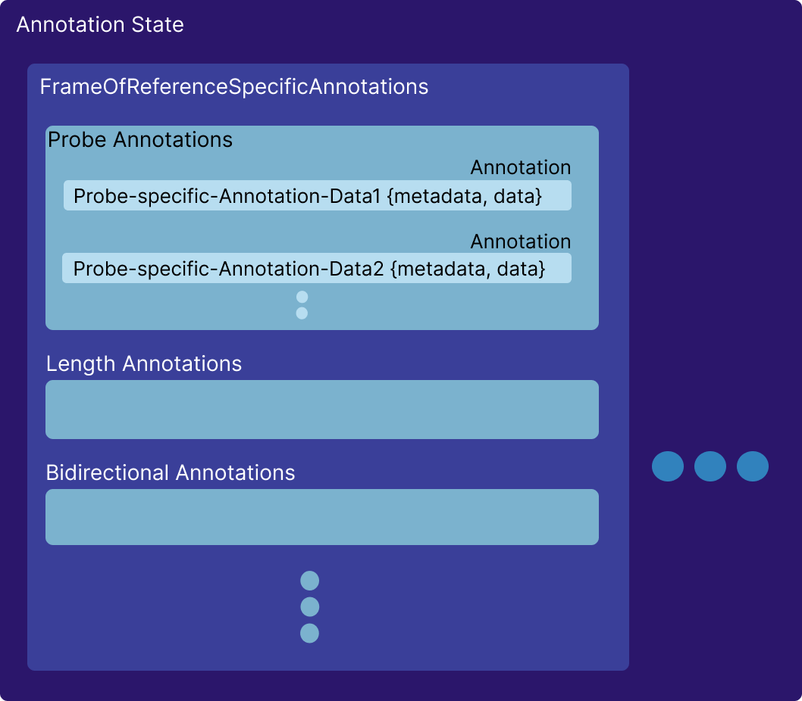

# 状态管理 {#state-management}

`Cornerstone3DTools` 实现了一个基于 `FrameOfReference`（参考坐标系）的
标注状态管理器，其中标注的点使用世界坐标。

## 标注数据 {#annotation-data}

当创建一个新标注时（标注工具中的 `addNewAnnotation` 方法），
会依据元数据和该工具的当前状态创建一份新的标注数据，
并把它加入全局标注状态。

下面展示的是一个 `ProbeTool` 实例的标注数据。其他工具基本遵循同样的模式。

```js
// ProbeTool 的标注数据
const annotation = {
  invalidated: boolean, // 标注数据是否已失效，例如控制点被移动过
  highlighted: boolean, // 标注是否因鼠标悬停而被高亮
  annotationUID: string, // 该标注的 UID
  metadata: {
    viewPlaneNormal: Types.Point3, // 相机的视平面法向量
    viewUp: Types.Point3, // 相机的视图上方向向量
    FrameOfReferenceUID: string, // 绘制该标注所在视口的 FrameOfReferenceUID
    referencedImageId?: string, // 绘制该标注所在的影像 ID（如适用）
    toolName: string, // 工具名
  },
  data: {
    handles: {
      points: [Types.Point3], // 控制点在世界坐标下的位置（探针工具 = 1 个控制点 = 1 个 x,y,z 点）
    },
    cachedStats: {}, // 该标注已保存的统计量
  },
}
```

## 标注状态 {#annotation-state}

标注状态按每个参考坐标系分别跟踪其标注。整个状态由若干
`FrameOfReference` 专属的状态对象组成，每个标注各自的状态就存放在其中。
下图是该状态对象的一个高层概览。

<div style={{textAlign: 'center', width:"80%"}}>



</div>

## API {#api}

可以用下面这些 API 获取 / 添加标注：

```js
// 添加标注
cornerstone3DTools.annotation.state.addAnnotation(
  annotation,
  element,
  suppressEvents
);

// 依据标注引用移除标注。
cornerstone3DTools.annotation.state.removeAnnotation(
  annotationUID,
  suppressEvents
);

// 返回给定工具的全部标注
cornerstone3DTools.annotation.state.getAnnotations(toolName, element);

// 一个辅助方法，返回与该 UID 匹配的那一条标注。
cornerstone3DTools.annotation.state.getAnnotation(annotationUID);
```

## 延伸阅读 {#read-more}

:::note TIP
关于状态 API 的更多内容见[这里](https://www.cornerstonejs.org/docs/api/tools/namespaces/annotation/namespaces/state)
:::
