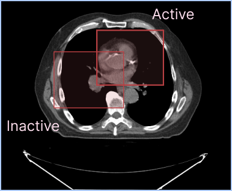

# 活动分割 {#active-segmentation}



每个视口可以同时显示多个分割表示形式，但每个视口只能有一个**活动分割**。
活动分割就是那个会被分割工具修改的分割。

活动分割与非活动分割可以采用不同的样式。例如，你可以在每个视口中
为活动分割和非活动分割分别配置不同的填充和轮廓属性。

如上图所示，你可以在同一个视口中显示多份标签图分割。默认情况下，
活动分割的轮廓线更粗一些，以便在视觉上与非活动分割区分开。

## 按视口划分的活动分割 {#viewport-specific-active-segmentations}

2.x 版本中有一个重要概念：活动分割是**按视口划分**的。这意味着：

- 每个视口可以有自己的活动分割
- 同一份分割可以在一个视口中是活动的、而在另一个视口中是非活动的
- 分割工具只会修改「它被使用的那个视口」中的活动分割

## API {#api}

活动分割 API 提供了按视口获取和设置活动分割的方法：

```js
import { segmentation } from '@cornerstonejs/tools';

// 取得某个视口的活动分割
const activeSegmentation = segmentation.getActiveSegmentation(viewportId);

// 设置某个视口的活动分割
segmentation.setActiveSegmentation(viewportId, segmentationId);
```

### 获取活动分割的数据 {#getting-active-segmentation-data}

拿到活动分割之后，就可以访问它的各项属性：

```js
const activeSegmentation = segmentation.getActiveSegmentation(viewportId);
```

### 处理多个视口 {#working-with-multiple-viewports}

不同视口可以有不同的活动分割：

```js
// 为不同视口设置不同的活动分割
segmentation.setActiveSegmentation('viewport1', 'segmentation1');
segmentation.setActiveSegmentation('viewport2', 'segmentation2');

// 查看各自的活动分割
const activeInViewport1 = segmentation.getActiveSegmentation('viewport1');
const activeInViewport2 = segmentation.getActiveSegmentation('viewport2');
```

请记住：工具在执行操作时会遵循这套按视口划分的活动分割设定。
