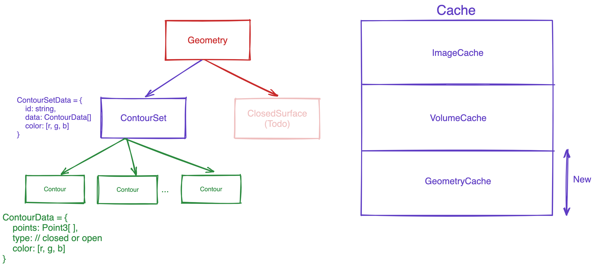

# 轮廓分割表示

轮廓分割表示是轮廓集的集合。每个轮廓集是轮廓的集合。每个轮廓是点的集合。每个点是3D坐标的集合。



## 轮廓集

通常，分割是多个结构的集合，每个轮廓集代表一个结构。例如，一个分割可以拥有多个轮廓集，每个轮廓集代表不同的结构。每个轮廓集都有一个唯一的ID和一个名称。名称用于在UI中显示结构名称。

## 轮廓

轮廓包含组成轮廓的点的信息。每个轮廓都有数据、类型（封闭或开放）和颜色。

## 加载轮廓作为分割表示

```js
// 加载每个轮廓集并缓存几何数据
const promises = contourSets.map((contourSet) => {
  return geometryLoader.createAndCacheGeometry(contourSet.id, {
    type: GeometryType.CONTOUR,
    geometryData: contourSet as Types.PublicContourSetData,
  });
});

await Promise.all(promises);

// 将分割添加到状态中
segmentation.addSegmentations([
  {
    segmentationId,
    representation: {
      // 分割的类型
      type: csToolsEnums.SegmentationRepresentations.Contour,
      // 实际的分割数据，在轮廓几何的情况下
      // 这是一条指向几何数据的引用
      data: {
        geometryIds: contourSets.map((contourSet) => contourSet.id),
      },
    },
  },
]);

// 将轮廓表示添加到特定视口
await segmentation.addContourRepresentationToViewport(viewportId, [
  {
    segmentationId,
    type: Enums.SegmentationRepresentations.Contour,
  },
]);