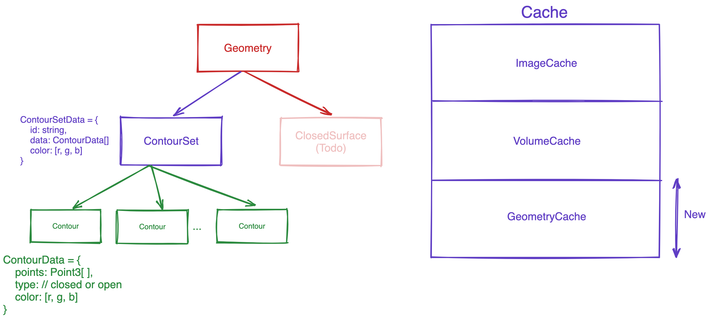

# 轮廓分割表示形式 {#contour-segmentation-representation}

轮廓分割表示形式是若干**轮廓集**的集合。每个轮廓集是若干**轮廓**的集合。
每条轮廓是若干**点**的集合。每个点则是一组三维坐标。



## 轮廓集 {#contour-set}

由于一份分割通常包含多个结构，每个轮廓集代表其中一个结构。
例如一份分割可以有多个轮廓集，各自代表一个不同的结构。
每个轮廓集都有唯一的 ID 和一个名称，名称用于在 UI 中显示该结构名。

## 轮廓 {#contour}

一条轮廓包含构成该轮廓的那些点的信息。每条轮廓都有 data、
type（闭合或开放）以及颜色。

## 把轮廓加载为分割表示形式 {#loading-contour-as-segmentation-representation}

```js
// 逐个加载轮廓集并缓存其几何数据
const promises = contourSets.map((contourSet) => {
  return geometryLoader.createAndCacheGeometry(contourSet.id, {
    type: GeometryType.CONTOUR,
    geometryData: contourSet as Types.PublicContourSetData,
  });
});

await Promise.all(promises);

// 把分割加入状态
segmentation.addSegmentations([
  {
    segmentationId,
    representation: {
      // 分割的类型
      type: csToolsEnums.SegmentationRepresentations.Contour,
      // 实际的分割数据。对轮廓几何而言，
      // 这里是指向几何数据的引用
      data: {
        geometryIds: contourSets.map((contourSet) => contourSet.id),
      },
    },
  },
]);

// 把轮廓表示形式添加到某个特定视口
await segmentation.addContourRepresentationToViewport(viewportId, [
  {
    segmentationId,
    type: Enums.SegmentationRepresentations.Contour,
  },
]);
```
