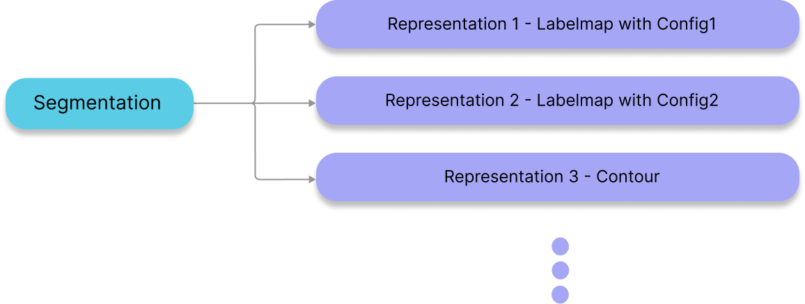

import DocCardList from '@theme/DocCardList';
import {useCurrentSidebarCategory} from '@docusaurus/theme-common';

# 分割 {#segmentations}

在 `Cornerstone3DTools` 中，我们把**分割**与**分割表示形式**这两个概念解耦了。
也就是说，从同一份**分割**可以创建出多种**分割表示形式**。例如，
可以从一份**分割**数据创建出三维标签图的**分割表示形式**，
也可以从同一份**分割**数据创建出轮廓的**分割表示形式**（暂未支持）。
这样我们就把**分割**的呈现层面与其底层数据解耦开了。



:::note TIP
类似的关系结构也被一些主流医学影像软件采用，例如
[3D Slicer](https://www.slicer.org/) 配合
[polymorph segmentation](https://github.com/PerkLab/PolySeg)。
:::

## API {#api}

与**分割**相关的函数和类都在 `segmentation` 模块中。

```js
import { segmentation } from '@cornerstonejs/tools';

// 分割状态，持有全部分割及其工具组专属的表示形式
segmentation.state.XYZ;

// 活动分割相关方法（set / get）
segmentation.activeSegmentation.XYZ;

// 针对某个分段索引的加锁（set / get）
segmentation.locking.XYZ;

// 分段索引的操作（set / get）
segmentations.segmentIndex.XYZ;
```

下面逐一深入这些方法。

<DocCardList items={useCurrentSidebarCategory().items}/>
