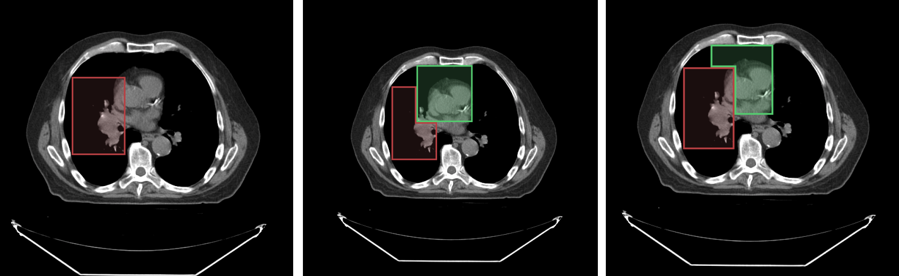

# 段锁定





您可以锁定分割中的特定段，以防止它们被任何工具修改。

例如，考虑下面带有叠加标签图的图像：
- 左图：显示 `段索引 1`
- 中图：显示当 `段索引 2` 绘制在 `段索引 1` 上方时的结果
- 右图：显示当 `段索引 1` 被锁定且 `段索引 2` 绘制在 `段索引 1` 上方时的结果

如右图的锁定场景所示，当段索引 1 被锁定时，新的绘制不能修改它。

![segment-locking-example]

## API

锁定 API 在版本 2.x 中已更新，以提供更清晰的方法名称和功能：

```js
import { segmentation } from '@cornerstonejs/tools';

// 锁定/解锁分割中的段索引
segmentation.locking.setSegmentIndexLocked(
  segmentationId,
  segmentIndex,
  locked
);

// 获取分割中的所有锁定段索引
const lockedIndices = segmentation.locking.getLockedSegmentIndices(segmentationId);

// 检查段索引是否被锁定
const isLocked = segmentation.locking.isSegmentIndexLocked(
  segmentationId,
  segmentIndex
);
```

### 使用示例

```js
// 锁定分割中的段 1
segmentation.locking.setSegmentIndexLocked('segmentation1', 1, true);

// 检查段 1 是否被锁定
const isLocked = segmentation.locking.isSegmentIndexLocked('segmentation1', 1);
console.log(`Segment 1 is ${isLocked ? 'locked' : 'unlocked'}`);

// 获取所有锁定的段
const lockedIndices = segmentation.locking.getLockedSegmentIndices('segmentation1');
console.log('Locked segment indices:', lockedIndices);

// 解锁段 1
segmentation.locking.setSegmentIndexLocked('segmentation1', 1, false);
```

### 版本 2.x 的关键更改

1. 为了清晰起见，将 `getLockedSegments` 重命名为 `getLockedSegmentIndices`
2. 锁定状态现在存储在段的数据结构中：

```js
{
  segments: {
    [segmentIndex]: {
      locked: boolean,
      // 其他段属性...
    }
  }
}
```

请注意，锁定状态适用于整个分割，而不是特定的显示或视口。如果一个段被锁定，它将在所有视口和显示中锁定。