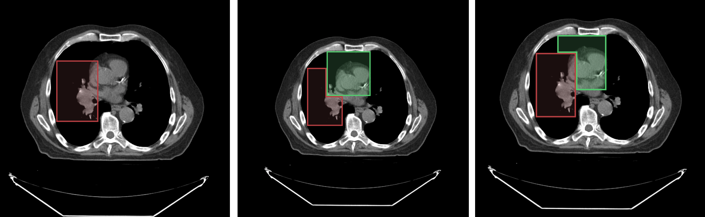

# 分段加锁 {#segment-locking}



你可以给一份分割中的特定分段加锁，防止它们被任何工具修改。

以上面这张叠加了标签图的影像为例：

- 左图：显示 `分段索引 1`
- 中图：显示在 `分段索引 1` 之上绘制 `分段索引 2` 后的结果
- 右图：显示 `分段索引 1` 被加锁后、再在其上绘制 `分段索引 2` 的结果

如加锁后的情形（右图）所示，当分段索引 1 被加锁时，新的绘制无法修改它。

## API {#api}

加锁 API 在 2.x 版本中做了更新，方法名和功能都更清晰：

```js
import { segmentation } from '@cornerstonejs/tools';

// 给某份分割中的某个分段索引加锁 / 解锁
segmentation.locking.setSegmentIndexLocked(
  segmentationId,
  segmentIndex,
  locked
);

// 取得某份分割中全部已加锁的分段索引
const lockedIndices =
  segmentation.locking.getLockedSegmentIndices(segmentationId);

// 查询某个分段索引是否已加锁
const isLocked = segmentation.locking.isSegmentIndexLocked(
  segmentationId,
  segmentIndex
);
```

### 用法示例 {#example-usage}

```js
// 给某份分割中的分段 1 加锁
segmentation.locking.setSegmentIndexLocked('segmentation1', 1, true);

// 查询分段 1 是否已加锁
const isLocked = segmentation.locking.isSegmentIndexLocked('segmentation1', 1);
console.log(`Segment 1 is ${isLocked ? 'locked' : 'unlocked'}`);

// 取得全部已加锁的分段
const lockedIndices =
  segmentation.locking.getLockedSegmentIndices('segmentation1');
console.log('Locked segment indices:', lockedIndices);

// 给分段 1 解锁
segmentation.locking.setSegmentIndexLocked('segmentation1', 1, false);
```

### 2.x 版本中的主要改动 {#key-changes-in-version-2x}

1. 为表意清晰，`getLockedSegments` 改名为 `getLockedSegmentIndices`。
2. 加锁状态现在保存在分段的数据结构中：

```js
{
  segments: {
    [segmentIndex]: {
      locked: boolean,
      // 其他分段属性……
    }
  }
}
```

注意：加锁状态作用于**整份分割**，而不是某个特定的表示形式或视口。
如果某个分段被加锁了，那么它在所有视口和所有表示形式中都是加锁的。
