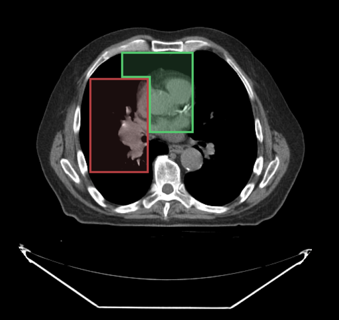

# 分段索引 {#segment-index}

用分割工具绘制时，可以指定使用哪个分段索引。下面的例子中，
我们用分段索引 API 把 `segmentIndex` 改为绘制第二个分段。

<div style={{textAlign: 'center', width: '500px'}}>



</div>

## API {#api}

```js
import { segmentation } from '@cornerstonejs/tools';

// 取得该 segmentationId 当前的活动分段索引
segmentation.segmentIndex.getActiveSegmentIndex(segmentationId);

// 设置该 segmentationId 的活动分段索引
segmentation.segmentIndex.setActiveSegmentIndex(segmentationId, segmentIndex);
```
