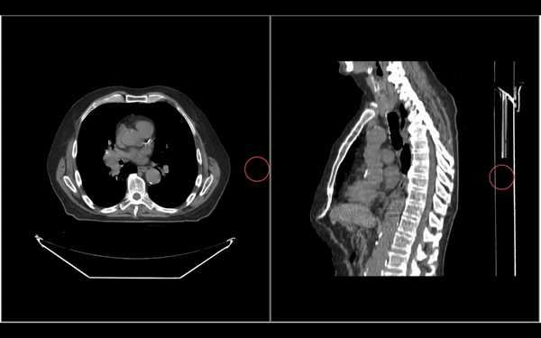
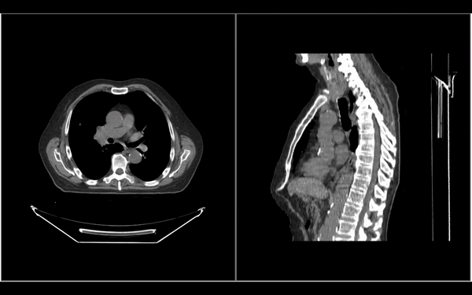
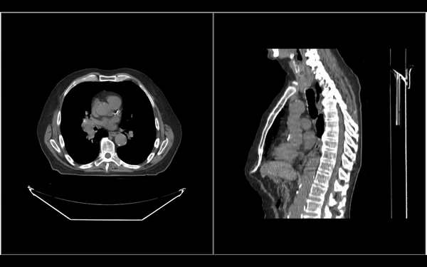
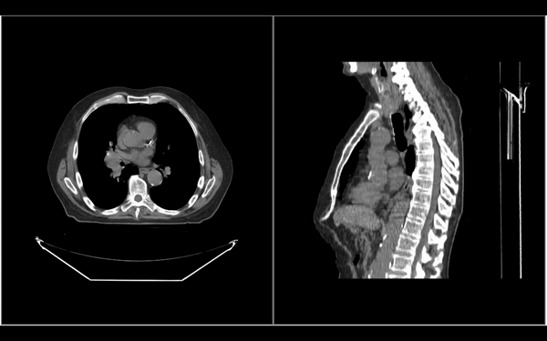
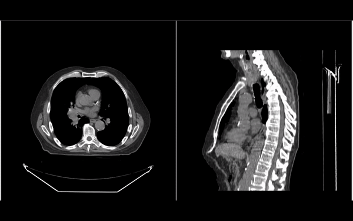

# 分割工具 {#segmentation-tools}

`Cornerstone3DTools` 提供了一组用于修改分割的工具，包括 `BrushTool`、
各类剪刀工具（例如 `RectangleScissor`、`CircleScissor`、`SphereScissor`），
以及 `RectangleRoiThresholdTool`。下面逐个详细介绍。

:::note Tip
所有分割工具都能在全部三种三维视图（轴位、冠状位、矢状位）中编辑分割。
:::

## 笔刷工具 {#brush-tool}

`BrushTool` 是分割中最常用的工具。它让你可以通过点击并拖拽来绘制分割
（如下图所示）。

要使用这个工具，需要像其他工具一样把它加入你的工具组。关于如何激活一个工具，
详见[工具](../tools.md#adding-tools)和[工具组](../toolGroups.md#toolgroup-creation-and-tool-addition)两节。

## 矩形剪刀工具 {#rectangle-scissor-tool}

`RectangleScissorTool` 可以用来创建矩形的分割。

## 圆形剪刀工具 {#circle-scissor-tool}

`CircleScissorTool` 可以用来创建圆形的分割。

## 球形剪刀工具 {#sphere-scissor-tool}

`SphereScissorTool` 可以用来创建球形的分割。它会在鼠标指针周围绘制一个三维球体。

## 阈值工具 {#threshold-tool}

`RectangleROIThresholdTool` 可以对用户绘制出的区域做阈值处理，从而创建分割。

（下图中设置了某个特定阈值来创建分割）

