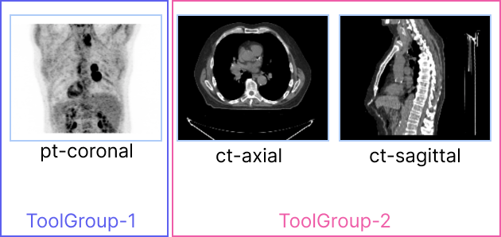

## 介绍

正如在 [`Tools`](./tools.md) 部分中讨论的，为了使用一个工具，你应该通过 `CornerstoneTools3D.addTool()` 先添加此工具，然后通过 `Tool Groups` 在视口上添加并激活它们。

工具组是在 `Cornerstone` 库中的一个新概念。`ToolGroup` 的目标是定义一种简单的方法，以便在每个视口/每个工具的基础上定义工具行为。此外，通过一个通用的 `ToolGroup`，视口可以共享相同的配置、模式和工具。

考虑以下一组视口，以及为滚动和平移需要实现的行为。

<div style={{textAlign: 'center'}}>


</div>

对于 `ct-axial` 和 `ct-sagittal` 视口，我们希望通过鼠标滚轮启用滚动，通过鼠标中键拖动进行平移。
然而，对于作为最大强度投影（MIP）视口的 `pt-coronal`，滚动切片是没有意义的，所期望的行为是通过鼠标滚轮旋转 MIP 体积并禁用平移。

<div style={{textAlign: 'center'}}>



</div>

:::note 重要
视口和工具组之间是一对一的关系。换句话说，没有视口可以成为多个工具组的一部分。
:::

## ToolGroup 创建和工具添加

`ToolGroups` 由 `ToolGroupManager` 管理。工具组管理器用于创建、搜索和销毁工具组。

> 目前，ToolGroups 不是可选的，为了使用工具，你应该创建一个 toolGroup 并将其添加到 toolGroup。

可以利用 ToolGroupManager 使用 `createToolGroup` 来创建一个工具组。

```js
import { ToolGroupManager } from '@cornerstonejs/tools';

const toolGroupId = 'ctToolGroup';
const ctToolGroup = ToolGroupManager.createToolGroup(toolGroupId);

// 向 ToolGroup 添加工具
// 操作工具
ctToolGroup.addTool(PanTool.toolName);
ctToolGroup.addTool(ZoomTool.toolName);
ctToolGroup.addTool(ProbeTool.toolName);
```

### 向 ToolGroups 添加视口

视口应使用 `addViewport` 添加到 `ToolGroup`。

```js
// 将工具组应用于视口或渲染场景的所有视口
ctToolGroup.addViewport(viewportId, renderingEngineId);
```

<details>
<summary>
为什么我们需要传递 `renderingEngineId`？
</summary>

原因是 `viewportId` 对渲染引擎是唯一的。你可以拥有多个渲染引擎，这些引擎包括具有相同 `viewportId` 的不同视口。

</details>

### 激活工具

你可以为每个工具组使用 `setToolActive` 来激活工具，并提供相应的鼠标绑定键。

```js
// 设置 ToolGroup 的工具模式
// 可能的模式包括：'Active', 'Passive', 'Enabled', 'Disabled'
ctToolGroup.setToolActive(LengthTool.toolName, {
  bindings: [{ mouseButton: MouseBindings.Primary }],
});
ctToolGroup.setToolActive(PanTool.toolName, {
  bindings: [{ mouseButton: MouseBindings.Auxiliary }],
});
ctToolGroup.setToolActive(ZoomTool.toolName, {
  bindings: [{ mouseButton: MouseBindings.Secondary }],
});
ctToolGroup.setToolActive(StackScrollMouseWheelTool.toolName);
```

其他工具模式也可以使用 `setToolEnabled`、`setToolPassive` 和 `setToolDisabled` 设置。

## ToolGroup 管理器

其他用于管理 ToolGroups 的方法可以通过 `ToolGroupManager` 获得。

### `getToolGroupForViewport`

返回给定视口的 ToolGroup，更多阅读 [这里](https://www.cornerstonejs.org/api/tools/namespace/ToolGroupManager#getToolGroupForViewport)

### `getToolGroup`

根据给定的 toolGroupId 返回 ToolGroup

### `destroyToolGroup`

销毁 ToolGroup