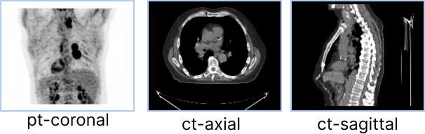
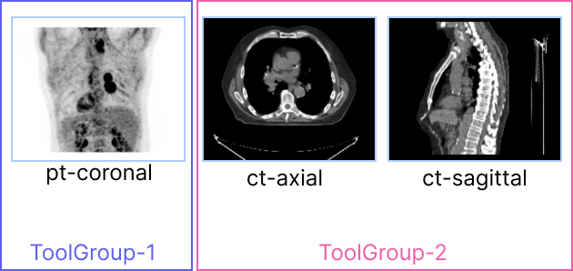

## 介绍 {#introduction}

正如[工具](./tools.md)一节所述，要使用一个工具，你应当先通过
`CornerstoneTools3D.addTool()` 添加该工具，**然后**再通过**工具组**
把它加到视口上并设为激活状态。

工具组是 `Cornerstone` 系列库中的一个新概念。`ToolGroup` 的目标是提供一种
简单的方式，按「每视口、每工具」的粒度定义工具行为。此外，
共享同一个 `ToolGroup` 的视口可以共用相同的配置、模式和工具。

来看下面这组视口，以及我们期望的滚动和平移行为。

<div style={{textAlign: 'center'}}>



</div>

对 `ct-axial` 和 `ct-sagittal` 这两个视口，我们希望用鼠标滚轮滚动切片、
用鼠标中键拖拽平移。但对 `pt-coronal` 来说，它是一个最大密度投影（MIP）视口，
逐切片滚动没有意义，我们期望的行为是用鼠标滚轮旋转 MIP 体数据、并禁用平移。

<div style={{textAlign: 'center'}}>



</div>

:::note Important
视口与工具组之间是一对一关系。换句话说，任何视口都不能同时属于多个工具组。
:::

## 创建工具组与添加工具 {#toolgroup-creation-and-tool-addition}

`ToolGroup` 由 `ToolGroupManager` 管理。工具组管理器用于创建、查找和销毁工具组。

> 目前工具组不是可选的：要使用某个工具，你必须创建一个工具组并把该工具加进去。

可以用 `ToolGroupManager` 的 `createToolGroup` 创建工具组。

```js
import { ToolGroupManager } from '@cornerstonejs/tools';

const toolGroupId = 'ctToolGroup';
const ctToolGroup = ToolGroupManager.createToolGroup(toolGroupId);

// 把工具加入工具组
// 操作工具
ctToolGroup.addTool(PanTool.toolName);
ctToolGroup.addTool(ZoomTool.toolName);
ctToolGroup.addTool(ProbeTool.toolName);
```

### 把视口加入工具组 {#adding-viewports-to-toolgroups}

应当用 `addViewport` 把视口加入 `ToolGroup`。

```js
// 把工具组应用到某个视口，或应用到渲染某个场景的所有视口
ctToolGroup.addViewport(viewportId, renderingEngineId);
```

<details>
<summary>
为什么需要传 `renderingEngineId`？
</summary>

原因是 `viewportId` 只在单个渲染引擎内唯一。你可以有多个渲染引擎，
它们各自包含带有相同 `viewportId` 的不同视口。

</details>

### 激活一个工具 {#activating-a-tool}

可以为每个工具组调用 `setToolActive` 来激活某个工具，并提供相应的鼠标绑定键。

```js
// 为每个工具设置该工具组中的工具模式
// 可能的模式包括：'Active'、'Passive'、'Enabled'、'Disabled'
ctToolGroup.setToolActive(LengthTool.toolName, {
  bindings: [{ mouseButton: MouseBindings.Primary }],
});
ctToolGroup.setToolActive(PanTool.toolName, {
  bindings: [{ mouseButton: MouseBindings.Auxiliary }],
});
ctToolGroup.setToolActive(ZoomTool.toolName, {
  bindings: [{ mouseButton: MouseBindings.Secondary }],
});
ctToolGroup.setToolActive(StackScrollMouseWheelTool.toolName);
```

其他工具模式也可以通过 `setToolEnabled`、`setToolPassive`
和 `setToolDisabled` 来设置。

## 工具组管理器 {#toolgroup-manager}

管理工具组的其他方法都可以通过 `ToolGroupManager` 取用。

### `getToolGroupForViewport` {#gettoolgroupforviewport}

返回给定视口所属的工具组，更多内容见
[这里](https://www.cornerstonejs.org/docs/api/tools/namespaces/toolgroupmanager/functions/gettoolgroupforviewport)。

### `getToolGroup` {#gettoolgroup}

返回给定 toolGroupId 对应的工具组。

### `destroyToolGroup` {#destroytoolgroup}

销毁一个工具组。
