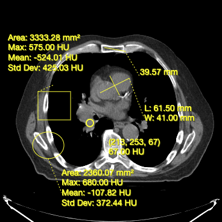
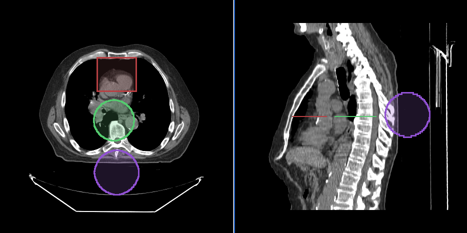

## 介绍

工具是一个未实例化的类，至少实现 `BaseTool` 接口。
工具可以通过其构造函数进行配置。要使用工具，必须：

- 使用库的顶级 `addTool` 函数添加未实例化的工具
- 按名称将该工具添加到 ToolGroup 中

在这里，我们将介绍 `Cornerstone3DTools` 中关于工具（注解和分割工具）的几个概念。

## 工具

### 操作工具

`Cornerstone3DTools` 提供了一组工具，可以用来操控视口中的图像。这些工具包括：

- 启用图像的放大和缩小（`ZoomTool`）
- 执行图像的平移和导航（`PanTool`）
- 滚动浏览图像（`StackScrollMouseWheelTool`）
- 操作图像的窗宽窗位（`WindowLevelTool`）

### 注解工具

`Cornerstone3DTools` 提供一组注解工具。您可以使用这些工具创建和编辑用于以下用例的注解：

- 测量两点之间的距离（长度工具）
- 测量两点之间的高度（高度工具）
- 测量结构的宽度和长度（双向工具）
- 测量矩形区域的面积和统计信息（矩形 Roi 工具）
- 测量椭圆体的体积和统计信息（椭圆 Roi 工具）
- 获取体素的底层值（探针工具）

下面，您可以看到在 `Cornerstone3DTools` 中可用的注解工具的截图。

<div style={{textAlign: 'center'}}>



</div>

### 动态工具统计

`Cornerstone3DTools` 能够根据正在渲染的体积的模式计算动态统计信息。例如，对于 CT 体积，`ProbeTool` 将提供亨斯菲尔德单位，对于 PET 则会计算 SUV 统计信息。

<div style={{textAlign: 'center', width:'85%'}}>


</div>

### 在参考框架中共享注解

由于注解存储在病人物理空间中，如果有两个视口显示相同的参考框架，它们将共享相同的注解。

### 分割工具

`Cornerstone3D` 还提供分割工具。这包括 3D 分割编辑工具，例如画笔、矩形和圆形剪刀，以及 3D 球体工具。

我们将在 [`分割`](./segmentation/index.md) 部分详细讨论不同类型的分割工具及其在 `Cornerstone3DTools` 中的使用。

<details>

<summary>工具内部如何工作</summary>

鼠标和键盘触发事件，这些事件被 `Cornerstone3DTools` 捕获并标准化。标准化的事件随后被触发，并作为 `mouseDown`、`mouseDrag` 和 `mouseUp` 事件由工具处理。

</details>

<div style={{textAlign: 'center', width:'85%'}}>



</div>

## 添加工具

`Cornerstone3DTools` 库随附了几个常用工具。所有工具要么实现 `BaseTool`，要么实现 `AnnotationTool`。为了能够使用这些工具，必须首先将它们添加到 `Cornerstone3DTools` 中。可以通过 `addTool` 函数实现。

```js
import * as csTools3d from '@cornerstonejs/tools';

const { PanTool, ProbeTool, ZoomTool, LengthTool } = csTools3d;

csTools3d.addTool(PanTool);
csTools3d.addTool(ZoomTool);
csTools3d.addTool(LengthTool);
csTools3d.addTool(ProbeTool);
```

:::note warning
将工具添加到库中只会告诉库这个工具的存在。
它不会自动将工具添加到任何工具组中，也不会实例化工具供使用。

:::

## 工具模式

工具（在它们的 toolGroup 中）可以处于四种模式之一。每种模式都会影响工具响应交互的方式。

> 绝不应该有两个具有相同绑定的活动工具

<table>
  <tr>
    <td>工具模式</td>
    <td>描述</td>
  </tr>
  <tr>
    <td>活动</td>
    <td>
      <ul>
        <li>具有活动绑定的工具将响应交互</li>
        <li>如果工具是注解工具，点击事件不在现有注解上将创建新注解。</li>
      </ul>
    </td>
  </tr>
  <tr>
    <td>被动（默认）</td>
    <td>
      <ul>
        <li>如果工具是注解工具，并且选择了它的把手或线条，可以移动和重新定位。</li>
      </ul>
    </td>
  </tr>
  <tr>
    <td>启用</td>
    <td>
      <ul>
        <li>工具将渲染，但不能进行交互。</li>
      </ul>
    </td>
  </tr>
  <tr>
    <td>禁用</td>
    <td>
      <ul>
        <li>工具将不会渲染。无法进行交互。</li>
      </ul>
    </td>
  </tr>
</table>