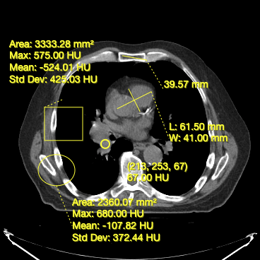
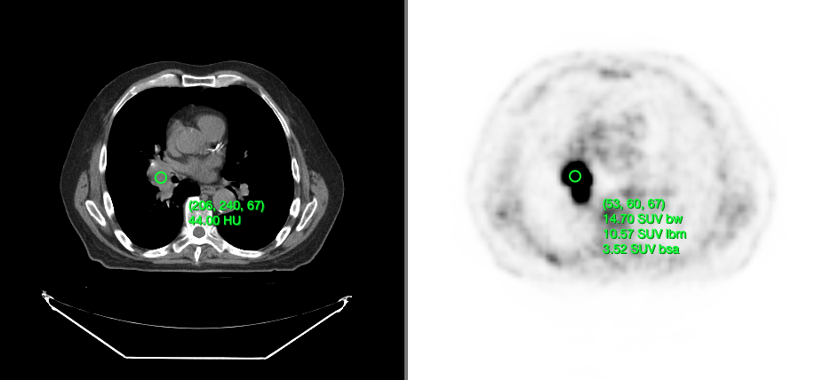
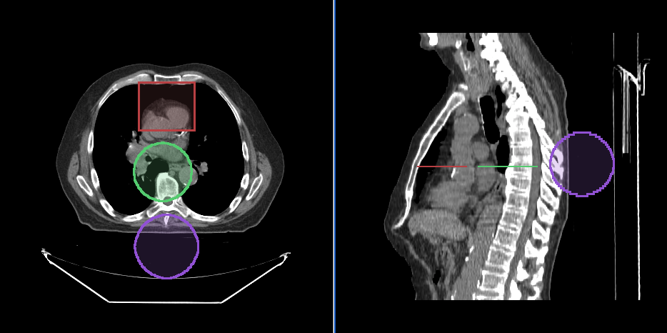

## 介绍 {#introduction}

工具是一个未实例化的类，至少实现 `BaseTool` 接口。
工具可以通过其构造函数进行配置。要使用一个工具，必须：

- 使用库的顶层 `addTool` 函数添加未实例化的工具
- 按名称把同一个工具添加到某个工具组（ToolGroup）中

下面介绍 `Cornerstone3DTools` 中关于工具（标注工具与分割工具）的几个概念。

## 工具 {#tools}

### 操作工具 {#manipulation-tools}

`Cornerstone3DTools` 提供了一组工具，用于操控视口中的影像。这些工具包括：

- 影像的放大与缩小（`ZoomTool`）
- 影像的平移与导航（`PanTool`）
- 滚动浏览影像（`StackScrollMouseWheelTool`）
- 调节影像的窗宽窗位（`WindowLevelTool`）

### 标注工具 {#annotation-tools}

`Cornerstone3DTools` 提供了一组标注工具。你可以用它们创建和编辑标注，适用于以下场景：

- 测量两点之间的距离（长度工具 Length Tool）
- 测量两点之间的高度（高度工具 Height Tool）
- 测量某个结构的宽度和长度（双向工具 Bidirectional Tool）
- 测量矩形区域的面积与统计量（矩形 ROI 工具 RectangleRoi Tool）
- 测量椭圆区域的面积与统计量（椭圆 ROI 工具 EllipseRoi Tool）
- 读取某个体素的原始值（探针工具 Probe Tool）

下图是 `Cornerstone3DTools` 中可用标注工具的截图。

<div style={{textAlign: 'center'}}>



</div>

### 动态工具统计 {#dynamic-tool-statistics}

`Cornerstone3DTools` 能够根据所渲染体数据的**模态**计算动态统计量。
例如对 CT 体数据，`ProbeTool` 给出的是亨氏单位（HU）；对 PET 则会计算 SUV 统计量。

<div style={{textAlign: 'center', width:'85%'}}>



</div>

### 在参考坐标系中共享标注 {#annotation-sharing-in-frame-of-reference}

由于标注存储在患者物理空间中，如果有两个视口显示的是同一个参考坐标系，
它们就会共享同一批标注。

### 分割工具 {#segmentation-tools}

`Cornerstone3D` 还提供分割工具，其中包括三维分割编辑工具，
例如笔刷、矩形剪刀、圆形剪刀，以及三维球体工具。

不同类型的分割工具及其在 `Cornerstone3DTools` 中的用法，
将在[分割](./segmentation/index.md)一节中详细讨论。

<details>

<summary>工具在内部是如何工作的</summary>

鼠标和键盘触发事件，这些事件由 `Cornerstone3DTools` 捕获并标准化。
标准化后的事件被重新触发，并以 `mouseDown`、`mouseDrag`、`mouseUp` 的形式交由工具处理。

</details>

<div style={{textAlign: 'center', width:'85%'}}>



</div>

## 添加工具 {#adding-tools}

`Cornerstone3DTools` 库内置了若干常用工具，它们都实现了 `BaseTool` 或 `AnnotationTool`。
要使用这些工具，必须先把它们添加到 `Cornerstone3DTools` 中，用 `addTool` 函数完成：

```js
import * as csTools3d from '@cornerstonejs/tools';

const { PanTool, ProbeTool, ZoomTool, LengthTool } = csTools3d;

csTools3d.addTool(PanTool);
csTools3d.addTool(ZoomTool);
csTools3d.addTool(LengthTool);
csTools3d.addTool(ProbeTool);
```

:::note warning
把工具添加到库中，只是让库知道这个工具的存在。
它不会自动把工具加入任何工具组，也不会实例化工具供使用。

:::

## 工具模式 {#tool-modes}

工具（在其所属的工具组中）可以处于四种模式之一。每种模式决定了工具如何响应交互。

> 绝不应该存在两个绑定相同的 Active 工具

<table>
  <tr>
    <td>工具模式</td>
    <td>说明</td>
  </tr>
  <tr>
    <td>Active（激活）</td>
    <td>
      <ul>
        <li>具有 active 绑定的工具会响应交互</li>
        <li>如果是标注工具，在已有标注之外的位置点击会创建一个新标注。</li>
      </ul>
    </td>
  </tr>
  <tr>
    <td>Passive（被动，默认）</td>
    <td>
      <ul>
        <li>如果是标注工具，当它的控制点或线条被选中时，可以移动和重新定位。</li>
      </ul>
    </td>
  </tr>
  <tr>
    <td>Enabled（启用）</td>
    <td>
      <ul>
        <li>工具会渲染，但无法交互。</li>
      </ul>
    </td>
  </tr>
  <tr>
    <td>Disabled（禁用）</td>
    <td>
      <ul>
        <li>工具不渲染，也无法交互。</li>
      </ul>
    </td>
  </tr>
</table>

### 拉伸视口中的标注 {#annotation-in-stretched-viewport}

工具优先保证世界坐标下的物理距离。**圆形 ROI** 由一个中心点和一个半径定义。
如果视口被拉伸，工具会自动渲染成椭圆。这样做是为了保证：你在拉伸后的视图里画一个圆，
它在患者体内仍然代表一个真正的物理圆形。

### 拉伸视口中的分割圆形笔刷光标 {#segmentation-circular-brush-cursor-in-stretched-viewport}

鼠标移动时，工具在画布坐标下计算光标形状，绘制一个以像素为单位定义半径的圆。
即使光标下方的影像被纵向拉伸了两倍，光标本身仍然是一个正圆。

### 拉伸视口中的分割圆形/球形笔刷、橡皮擦与剪刀工具 {#segmentation-circularsphere-brusheraserscissor-tools-in-stretched-viewport}

工具会把画布空间中的圆映射到底层影像像素上。无论影像是否被拉伸，
笔刷画出的都应该是正圆而不是椭圆。当影像被拉伸或压缩时，
已绘制的分段也应随影像成比例地拉伸或压缩。
