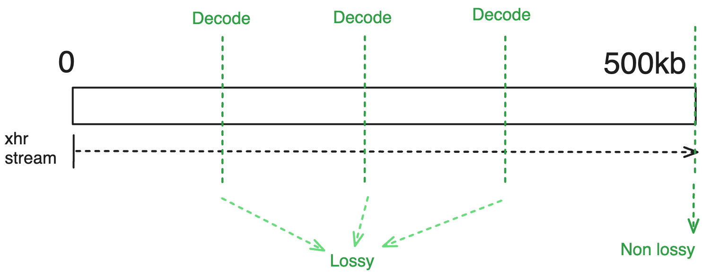

# 检索配置

渐进式加载以称为 `stages` 的步骤进行。每个阶段都是**哪些图像用哪些设置加载**的一部分，您可以为每个阶段设置不同的设置，这些设置称为 `retrieve options`。这些（阶段和选项）共同组成了 `retrieve configuration`，它管理图像如何逐步加载。让我们深入了解。

```ts
interface IRetrieveConfiguration {
  stages: RetrieveStage[];
  retrieveOptions: Record<string, RetrieveOptions>;
}
```

## 检索阶段

正如渐进式加载的名称所示，加载过程是分阶段进行的。每个 `stage` 可以配置为使用不同的检索方法（流媒体或 byteRange）以及其通用或特定的检索选项。

:::info
由于您可以有多个阶段，这两种方法（流媒体和字节范围）可以结合在不同的阶段使用。

例如，您可以创建一个配置：

1.  开始特定初始片段的**流媒体**（通常是第一个、中间或最后一个片段）以便立即查看。
2.  随后，在第二阶段，可以对其余片段进行**字节范围请求**（仅几个`kb`）以尽可能快地高效呈现完整体积（即使是有损的）。
3.  最后，您可以对尚未请求的剩余部分执行补充的**字节范围请求**，跟随第二步中的初始字节范围请求。

这种方法实际上在体积加载过程中使用，我们将在随后的讨论中进一步详细说明。
:::

总而言之，检索阶段是一个指定哪些图像用哪些设置加载的配置。为了简化本文档并不失焦点，我们将仅讨论 `retrieveType`，它只是一个对检索选项的引用。我们将在以后讨论更多高级选项，例如选择图像策略、优先级和队列加载。


<!--  -->

如上所示，检索阶段可以简单到只是一组对象列表，每个对象都有一个 `id`
和一个 `retrieveType`（这是我们将要讨论的检索选项的引用）。

:::tip
`retrieveType` 是一个可选字符串，仅用于引用要使用的选项。您可以使用任何字符串，只要在检索选项中也一致地使用它。可以使用 `'lkajsdflkjaslfkjsadlkfj'` （如果愿意，但在 `retrieveOptions` 对象中也应有一个键为 `'lkajsdflkjaslfkjsadlkfj'` 的对象，如下所见）。
:::

<details>
<summary>
如果我们引用未在检索选项中定义的检索类型，会发生什么情况？
</summary>

Cornerstone 将检查是否指定了 `default` 检索选项，如果是，则使用它，否则将忽略渐进加载配置并像未启用渐进加载一样加载图像（如以前一样）
</details>

## 检索选项

现在我们可以更详细地讨论每种方法（流媒体或字节范围）的检索选项。让我们先深入了解通用选项。

### 通用选项

检索配置有更高级的选项，可以用于处理更多用例。我们将在另一个部分稍后讨论它们。

#### 解码级别（质量）

一个自然的问题是，无论使用哪种方法（流或字节范围），图像解码的频率是多少，以及解码时应该解码到什么分辨率？

解码分辨率由 `decodeLevel` 配置控制，可以是：

- 0 = 全分辨率
- 1 = 一半分辨率
- 2 = 四分之一分辨率
- 3 = 八分之一分辨率
- ...

因此，如果一个阶段的 decodeLevel 设置为 0，则图像将被解码为全分辨率。如果设置为 1，则图像将被解码为一半分辨率（x/2, y/2）等等。

:::tip
对于体积视窗，我们当前不允许解码为子分辨率，因为这需要在内存中重新分配体积，这效率低下。因此，如果数据不完整且无法解码为全分辨率，我们只是在 Web 工作人员中复制作为整个体积。

但是，对于堆栈视口，我们允许解码为子分辨率，因为这种重新分配比整个体积便宜。此外，在这种情况下，将新尺寸的图像擦除旧图像，直到达到全分辨率。
:::

我们将在各方法部分中讨论 `频率`。

### 流媒体选项

#### 选项

对于流媒体请求，您可以配置以下选项：

- `streaming`: 是否使用流媒体

#### 解码频率

通常，当流媒体来自服务器时，服务器会让客户端知道数据的最终大小。因此，在每个时刻，我们可以确定已下载数据的百分比，并将图像解码为相关分辨率，因此在流媒体场景中，您不必手动设置它。

不同的级别如果在解码时下载部分为：

- < 8 % 总数据量，则解码到 3 级
- 8 < x < 13 % 总数据量，则解码到 2 级
- 13 < x < 27 % 总数据量，则解码到 1 级
- < 100（表示未完成）则解码到 0 级
- 100 % 总数据量（流媒体完成），则解码到 0 级

:::tip
我们是如何确定这些级别的？这其实很简单。

例如，如果我们只下载了总数据量的 1/16，则表示我们下载了 6.25 % 的数据（8 % 是 6.25 % 的一些偏移）。这意味着我们可以将图像解码为原始尺寸的 1/16，即第4级。但是，解码器提供的插值略优于直接图像渲染提供的插值，因此可以解码为略低的级别，即第3级。
同样的逻辑适用于其余级别。
:::

关于将发生多少次解码完全取决于初始下载的数据及其流媒体进度。但在任何时间，当数据下载时，我们将进度检查与上述级别对比，并尽可能将图像解码到相关分辨率。如果出现错误或未解码图像，我们只需等待下一个进度事件的发生。

#### 示例

对于简单的流媒体场景（流媒体开启），您应期望如下行为：



#### 使用场景

使用流媒体方法适用于最终需要数据的全分辨率并希望尽快开始查看数据的场景。

### 字节范围选项

#### 选项

- `chunkSize`: 初始解码的字节范围值（默认是 64kb）。
  忽略除第一个范围请求之外的所有值（无论 rangeIndex）。
- `rangeIndex`: 是要获取的范围编号（索引），-1 表示剩余数据

请注意，不能保证 rangeIndex 实际会获取另一个
范围，因为一旦获取到所有数据，范围请求将中断。
另外，-1 用于标记“剩余”数据。

#### 解码频率

字节范围请求有两种场景：

- 如果服务器在响应的字节范围头中发送总数据大小，则我们使用自动解码频率（类似流媒体场景）。
- 服务器没有在响应的字节范围头中发送总数据大小，则我们等待范围请求完成后再解码图像。

:::tip
服务器应发送 cors 头 `Access-Control-Expose-Headers: *` 以使读取 `Range-Response` 头所需的总数据大小变得可能。
否则，范围请求在 multipart/related 头完成或返回数据量小于请求数据量时设置完成。
:::

#### 示例

例如对于以下选项

```js
{
  rangeIndex: 0,
  chunkSize: 256000, // 256kb
}
```


另一个示例

```js
{
  rangeIndex: 0,
  decodeLevel: 3
}

// chunkSize 默认是 64kb
```


:::tip
您可以使用 `rangeIndex: -1` 获取剩余数据。
此外，`rangeIndex = 0` 将始终是第一个片段。

例如，如果有 4 个范围，则范围将是：

- `rangeIndex 0`: `0` 到 `chunkSize-1`（以字节为单位）
- `rangeIndex 5`: `chunkSize` 到 `5 * chunkSize-1`（以字节为单位）
- `rangeIndex 25`: `5 * chunkSize` 到 `25 * chunkSize-1`（以字节为单位）
- `rangeIndex -1`: `25 * chunkSize` 到 `totalSize`（以字节为单位）的剩余数据

这种使用 rangeIndex 的方法允许按解码级别值所需的数据量来检索较大的增量。
:::

<details>
<summary>
如果我从范围 1 而不是 0 开始，会怎样？
</summary>

Cornerstone 将自动将范围 0 和范围 1 作为单个请求获取。
这样可以避免执行多个中间请求。
</details>

#### 使用场景

除了我们可以使用范围请求逐步请求和加载更高质量的图像外，还有其他一些用例：

- 缩略图：通常，对于缩略图，我们希望尽快加载图像，但不需要全分辨率。我们可以使用字节范围请求获取低分辨率版本的数据。
- CINE：对于某些成像需求，在连拍模式下帧率绝对重要。通常，这些场景下追求总体形态而不是细节，但是帧率更为重要。我们可以使用字节范围请求获取子分辨率数据，确保达到目标帧率。

将来，可能会为范围请求详细信息使用单独的内存缓存，但当前中间数据与图像数据一起保存。将其存储在缓存中将允许以仅图像解码成本进行连拍显示。

## 结论

我们了解到，“检索配置”至少由一个（可以更多）“检索阶段”以及在“检索阶段”中引用键的伴随“检索选项”组成。我们还了解到，每个“检索阶段”可以配置为使用不同的方法（流媒体或字节范围），并具有通用或特定的检索选项。

让我们看一个在 stackProgressive 示例中使用的示例

```js
const retrieveConfiguration = {
  stages: [
    {
      id: 'initialImages',
      retrieveType: 'single',
    },
  ],
  retrieveOptions: {
    single: {
      streaming: true,
    },
  },
};
```

:::tip
请注意在 `stages` 和 `retrieveOptions` 对象中广泛使用的“single”。这只是一个对我们在 `retrieveOptions` 对象中定义的检索选项的引用。
:::

现在您的问题可能是，我们如何[使用此配置](./usage)？我们将在下一节讨论这个问题。但好奇的读者可以移至高级配置部分，了解我们为检索配置提供的更多高级选项。