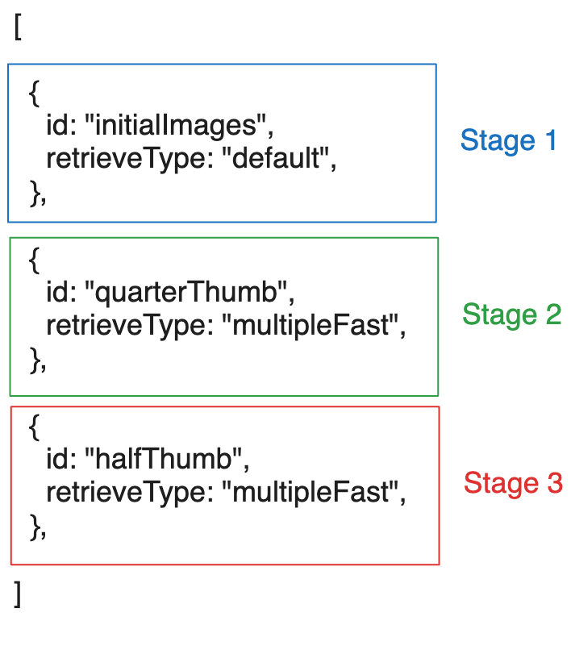
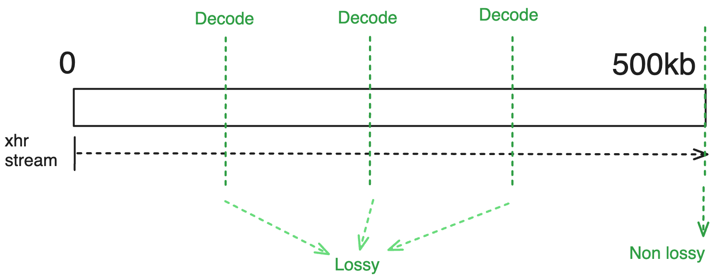
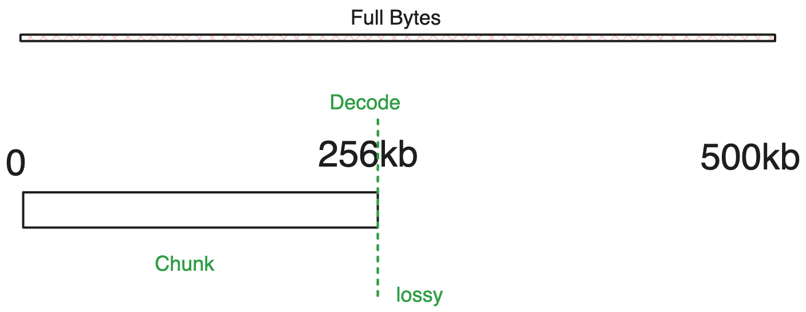
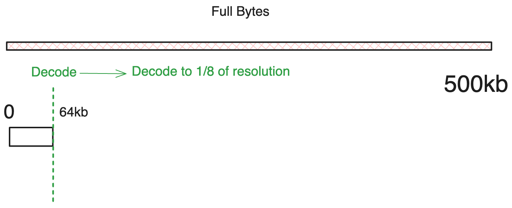

# 取回配置 {#retrieve-configuration}

渐进式加载按称为**阶段**（`stages`）的步骤来工作。每个阶段规定了
**哪些影像以何种设置加载**，而你可以给每个阶段配上不同的设置，
也就是**取回选项**（`retrieve options`）。两者合起来（阶段 + 选项）
构成**取回配置**（`retrieve configuration`），
它管理影像如何一步步被加载。下面来细看。

```ts
interface IRetrieveConfiguration {
  stages: RetrieveStage[];
  retrieveOptions: Record<string, RetrieveOptions>;
}
```

## 取回阶段 {#retrieve-stages}

正如「渐进式加载」这个名字所暗示的，加载过程是分**阶段**完成的。
每个**阶段**都可以配置为使用不同的取回方式（流式或字节范围），
以及它通用的或专有的取回选项。

:::info
由于可以有多个阶段，这两种方式（流式和字节范围）可以组合起来、在不同阶段分别使用。

举例来说，你可以创建这样一份配置：

1.  先对特定的若干初始切片（通常是第一张、中间那张或最后一张）
    启动**流式**加载，以便立刻能看。
2.  接着在第二阶段，对其余切片发出**字节范围请求**（只要几个 `kb`），
    从而尽快高效地渲染出完整的体数据（即便是有损的）。
3.  最后，在第 2 步那次初始字节范围请求之后，
    再对尚未请求的那些剩余片段发出补充的**字节范围请求**。

这套做法实际上正是体数据加载过程所采用的，后文会进一步展开。
:::

所以总结一下：取回阶段是一份配置，规定了哪些影像以何种设置加载。
为了本文简洁、不跑偏，我们只讲 `retrieveType`——它只是一个指向取回选项的引用。
更进阶的选项，比如为策略挑选影像、设定优先级、以及加载排队，稍后再讨论。



如上所示，取回阶段可以简单到只是一个对象列表，每个对象带一个 `id`
和一个 `retrieveType`（它是对取回选项的引用，下面就讲）。

:::tip
`retrieveType` 是一个可选字符串，唯一用途就是引用要使用的那个选项。
只要你在取回选项里**也**保持一致，用任何字符串都行。
你要是愿意，用 `'lkajsdflkjaslfkjsadlkfj'` 也可以
（但那样你就得在 `retrieveOptions` 对象里有一个键为
`'lkajsdflkjaslfkjsadlkfj'` 的对象，下面会看到）。
:::

<details>
<summary>
如果我们引用了一个在取回选项里没有定义的取回类型，会发生什么？
</summary>

Cornerstone 会检查是否指定了 `default` 取回选项；如果有，就用那个；
否则就忽略渐进式加载配置，像没有启用渐进式加载那样加载影像（和以前一样）。

</details>

## 取回选项 {#retrieve-options}

现在可以更细致地讨论两种方式（流式或字节范围）各自的取回选项了。
先从通用选项开始。

### 通用选项 {#common-options}

取回配置还有一些更进阶的选项，用来应对更多使用场景。这些我们放到另一节再讲。

#### 解码级别（质量） {#decode-level-quality}

一个自然会冒出来的问题是：无论用哪种方式（流式或字节范围），
影像会被解码多少次？而当我们解码时，应该解码到什么分辨率？

解码的分辨率由 `decodeLevel` 配置控制，可取：

- 0 = 完整分辨率
- 1 = 二分之一分辨率
- 2 = 四分之一分辨率
- 3 = 八分之一分辨率
- ……

所以如果某个阶段的 decodeLevel 设为 0，影像就会被解码到完整分辨率；
设为 1 则解码到二分之一分辨率（x/2, y/2），以此类推。

:::tip
对体数据视口，我们目前不允许解码到亚分辨率，
因为那会需要在内存中重新分配这份体数据，效率不高。因此，
如果数据是部分的、无法解码到完整分辨率，
我们就简单地把它复制（为性能考虑放在 web worker 内做）来填满整份体数据。

不过对堆栈视口，我们确实允许解码到亚分辨率，
因为这里的重新分配比整份体数据便宜得多。此外在这种情形下，
后续更高质量的影像会把旧影像整个替换掉、按新尺寸创建一张新影像，
直到达到完整分辨率。
:::

关于 `frequency`（频率），我们放到下面各自方式的小节里讲。

### 流式选项 {#streaming-options}

#### 选项 {#options}

对流式请求，可以配置以下选项：

- `streaming`：是否使用流式

#### 解码频率 {#decoding-frequency}

大多数情况下，当数据流来自服务器时，服务器会告知客户端数据的最终大小。
于是在任一时刻，我们都能算出已下载数据的百分比，
并把影像解码到相应的分辨率——所以在流式场景下你其实不需要手动设置它。

各个级别的划分是：如果解码时刻已下载的部分占总数据的比例为

- \< 8 \%，则解码到级别 3
- 8 \< x \< 13 \%，则解码到级别 2
- 13 \< x \< 27 \%，则解码到级别 1
- \< 100（意味着还没结束），则解码到级别 0
- 100 \%（数据流已结束），则解码到级别 0

:::tip
这些级别是怎么定出来的？其实挺简单。

举例来说，如果我们只下载了总数据的 1/16，就意味着下载了 6.25% 的数据
（8% 就是 6.25% 加上一点余量）。这意味着我们可以把影像解码到原始尺寸的 1/16，
也就是级别 4。不过，解码器提供的插值比直接做影像渲染的插值稍好一些，
因此可以解码到略低一级、也就是改用级别 3。其余级别同理。
:::

至于「会发生多少次解码」这个问题，那完全取决于最初下载到的数据量
以及数据流的推进情况。但在任何时刻只要有数据下载进来，
我们就会拿进度与上面那些级别比对，可能的话就把影像解码到相应分辨率。
如果抛出错误、或者影像没解出来，我们就只是等待下一次进度事件。

#### 示例 {#example}

对最简单的流式场景（streaming 为 true），你应当看到如下行为：



#### 适用场景 {#use-cases}

流式方式适用于这样的场景：你最终确实需要数据的完整分辨率，
同时希望尽早开始查看数据。

### 字节范围选项 {#byte-range-options}

#### 选项 {#options-1}

- `chunkSize`：用于初次解码所取的字节范围大小（默认 64kb）。
  除第一次范围请求之外一律忽略（不论 rangeIndex 为何）。
- `rangeIndex`：你想取的那个范围编号（索引），取 -1 表示剩余数据

注意并不保证 rangeIndex 一定会真的再取一个范围，
因为一旦全部数据都取完了，取回就会停止。另外，-1 用来标记「剩余」数据。

#### 解码频率 {#decoding-frequency-1}

字节范围请求有两种情形：

- 服务器在该字节范围响应的头部回传了数据总大小，
  此时我们采用自动解码频率（与流式场景类似）。
- 服务器没有在该字节范围响应的头部回传数据总大小，
  此时我们等这次范围请求结束后再解码影像。

:::tip
服务器应当发送 CORS 头 `Access-Control-Expose-Headers: *`，
以便能读取查看总大小所需的 `Range-Response` 头。
否则，范围请求的结束判定是：multipart/related 头已完整，
**或**返回的数据小于所请求的数据量。
:::

#### 示例 {#example-1}

例如对于这样的选项

```js
{
  rangeIndex: 0,
  chunkSize: 256000, // 256kb
}
```



另一个例子

```js
{
  rangeIndex: 0,
  decodeLevel: 3
}

// chunkSize 取默认值 64kb
```



:::tip
可以用 `rangeIndex: -1` 取回剩余数据。
另外，`rangeIndex = 0` 永远是第一个分块。

举例来说，如果你有 4 个范围，那么各范围为

- `rangeIndex 0`：`0` 到 `chunkSize-1`（字节）
- `rangeIndex 5`：`chunkSize` 到 `5 * chunkSize-1`（字节）
- `rangeIndex 25`：`5 * chunkSize` 到 `25 * chunkSize-1`（字节）
- `rangeIndex -1`：`25 * chunkSize` 到 `totalSize`（字节）—— 也就是剩下的数据

这种 rangeIndex 的用法让我们能按更大的增量取回数据，
以匹配各个 decodeLevel 取值所需要的数据量。
:::

<details>
<summary>
如果我从范围 1 而不是 0 开始，会怎样？
</summary>

Cornerstone 会自动把范围 0 与范围 1 合并成单个请求一起取回。
这样就不必执行多次中间请求。

</details>

#### 适用场景 {#use-cases-1}

除了用范围请求来渐进式地请求并加载更高质量的影像之外，
还有其他一些使用场景：

- 缩略图：做缩略图时我们往往希望影像尽快加载出来，
  但并不需要完整分辨率。可以用字节范围请求取回数据的低分辨率版本。
- CINE（动态回放）：在某些成像需求下，cine 模式的帧率是绝对关键的。
  这类场景通常想看的是大体解剖结构、而非细节，帧率的重要性更高。
  可以用字节范围请求取回数据的亚分辨率版本，从而保证达到目标帧率。

将来可能会为范围请求的细节单独设一个内存缓存，
但目前那些中间数据是与影像数据放在一起的。
把它存进缓存之后，CINE 显示就只需付出解码影像的开销。

## 小结 {#conclusion}

至此我们知道：一份「取回配置」由至少一个（也可以更多）「取回阶段」
以及配套的「取回选项」构成，而后者的键正是「取回阶段」中所引用的那些。
我们也知道了每个「取回阶段」都可以配置为使用不同的方式（流式或字节范围），
并拥有通用的或专有的取回选项。

来看一个 stackProgressive 演示中的实际例子：

```js
const retrieveConfiguration = {
  stages: [
    {
      id: 'initialImages',
      retrieveType: 'single',
    },
  ],
  retrieveOptions: {
    single: {
      streaming: true,
    },
  },
};
```

:::tip
注意 `stages` 和 `retrieveOptions` 两个对象里都用到了 'single'。
这只是对我们在 `retrieveOptions` 对象中所定义的那个取回选项的引用。
:::

那么你现在的问题可能是：怎么[使用这份配置](./usage.md)？
下一节就会讲到。不过好奇的读者也可以直接跳到进阶配置那一节，
去了解取回配置还有哪些进阶选项。
