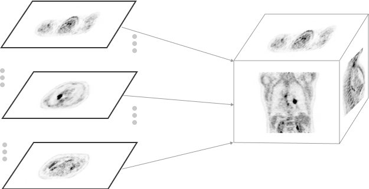

# 体数据的流式加载 {#streaming-of-volume-data}

随着[体数据](../cornerstone-core/volumes.md)被引入 `Cornerstone3D`，
我们同时新增并维护了 `Streaming-volume-image-loader`——
一个面向体数据的渐进式加载器。这个加载器的设计是接收一批 imageId，
并把它们加载进一份**体数据**。

## 从影像构建体数据 {#creating-volumes-from-images}

由于三维**体数据**是由二维影像构成的（在 `StreamingImageVolume` 中如此），
它的体数据元数据是从这些二维影像的元数据推导出来的。
因此这个加载器需要先发起一次请求来取得影像的元数据。这样一来，
我们不仅能在内存中预分配并缓存一份**体数据**，
还能在二维影像陆续加载的过程中就渲染这份体数据（也就是渐进式加载）。



通过预取所有影像（`imageIds`）的元数据，
我们就不必为每个 imageId 都创建[影像](../cornerstone-core/images.md)对象，
而是可以直接把影像的像素数据插入到体数据中正确的位置上。
这保证了速度和内存效率（代价只是预取元数据这一点小开销）。

## 体数据与影像之间的互相转换 {#converting-volumes-fromto-images}

`StreamingImageVolume` 是基于一系列取来的（二维）影像加载体数据的；
反过来，一份**体数据**也可以实现一些函数，
把它的三维像素数据转换成二维影像，而不必再走一遍网络请求。
例如通过 `convertToCornerstoneImage`，`StreamingImageVolume` 实例接收一个
imageId 及其 imageId 索引，返回一个 Cornerstone Image 对象
（需要 imageId 索引，是因为我们要在三维数组中定位该 imageId 的像素数据
并把它复制到 Cornerstone Image 上）。

这个过程是可逆的：只要一组 `imageId` 具备体数据应有的属性
（相同的 FrameOfReference、原点、维度、方向和像素间距），
`Cornerstone3D` 就能从它们构建出一份体数据。

## 用法 {#usage}

如前所述，应当先依据影像元数据创建一份预缓存的体数据。
这可以通过调用 `createAndCacheVolume` 完成。

```js
const ctVolumeId = 'cornerstoneStreamingImageVolume:CT_VOLUME';
const ctVolume = await volumeLoader.createAndCacheVolume(ctVolumeId, {
  imageIds: ctImageIds,
});
```

然后就可以调用该体数据的 `load` 方法，真正去加载那些影像的像素数据。

```js
await ctVolume.load();
```

## imageLoader {#imageloader}

由于体数据加载器不需要为 `StreamingImageVolume` 中的每个 imageId
都创建[影像](../cornerstone-core/images.md)对象，
它会在内部使用 `skipCreateImage` 选项来跳过影像对象的创建。
除此之外，体数据所用的影像加载器与 `cornerstone-wado-image-loader`
中编写的 wadors 影像加载器是相同的。

```js
const imageIds = ['wadors:imageId1', 'wadors:imageId2'];

const ctVolumeId = 'cornerstoneStreamingImageVolume:CT_VOLUME';

const ctVolume = await volumeLoader.createAndCacheVolume(ctVolumeId, {
  imageIds: ctImageIds,
});

await ctVolume.load();
```

## 值得考虑的其他实现方式 {#alternative-implementations-to-consider}

尽管我们认为这种针对体数据的预取方式能保证体数据以最快的速度加载完成，
但体数据加载器也可以有别的实现方式，不依赖这种预取。

#### 不预取元数据来构建体数据 {#creating-volumes-without-pre-fetching-metadata}

在这种方案下，每张影像都需要单独创建，
也就是说每张影像都要被加载、并创建出一个 Cornerstone
[影像](../cornerstone-core/images.md)对象。这是一项开销很大的操作，
因为所有影像对象都被加载进内存，
并且还需要再从这些影像单独创建出一份[体数据](../cornerstone-core/volumes.md)。

优点：

- 不需要额外发一次元数据请求去取影像元数据。

缺点：

- 性能开销
- 无法渐进式加载影像数据，因为每换一张影像都要创建一份新的体数据
