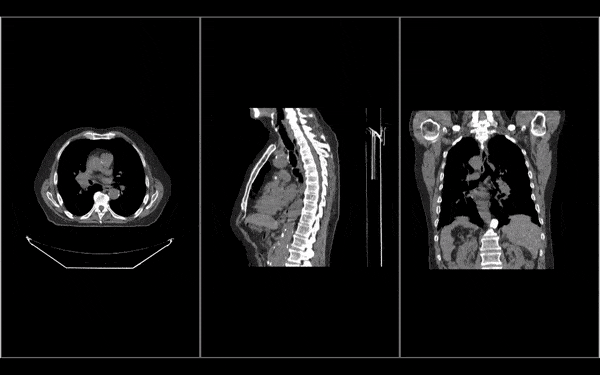
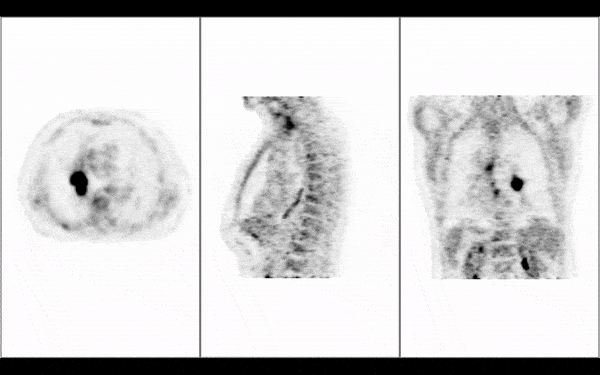

import Link from '@docusaurus/Link';

# 概述

`Cornerstone3D` 是一个轻量级的 JavaScript 库，用于在支持 HTML5 canvas 元素的现代浏览器中
可视化医学影像。借助 `@cornerstonejs/core` 及其配套库（例如 `@cornerstonejs/tools`），
可以完成相当广泛的影像处理任务。

 

<Link target={"_blank"} to="https://www.cornerstonejs.org/live-examples/petCT.html">
    <button id="open-ptct-button">
        打开 PT/CT 演示
    </button>
</Link>

 
 

<Link target={"_blank"} to="https://www.cornerstonejs.org/live-examples/local.html">
    <button id="open-local-button">
        打开本地 DICOM 演示
    </button>
</Link>

## 功能

### 渲染

使用 `Cornerstone3D` 的渲染引擎及其堆栈视口和体数据视口，可以：

- 渲染所有传输语法，包括 JPEG2000、JPEG Lossless 等各类压缩格式
- 流式加载体数据的切片，边加载边实时查看
- 以轴位、冠状位、矢状位等不同方位查看同一份体数据，无需重新加载整份数据（内存占用最小）
- 查看体数据中的斜切面
- 对同一份体数据应用不同的混合方式（例如最大密度投影 MIP 与平均密度投影）
- 融合并叠加多份影像，例如 PET/CT 融合
- 渲染彩色影像，并将其作为体数据渲染
- 在 GPU 渲染不可用时回退到 CPU 渲染
- 通过修改视口的元数据来改变影像的校准信息（例如像素间距）

### 影像操作

`Cornerstone3DTools` 提供以下能力：

- 通过鼠标绑定放大和缩小影像
- 向任意方向平移影像
- 以任意方位滚动浏览影像，斜切面同样适用
- 调节影像的窗宽窗位

### 标注

`Cornerstone3DTools` 还支持用工具对影像进行标注。所有标注都以 SVG 元素渲染，
这保证了它们在任何显示器分辨率下都能以最佳质量显示。`Cornerstone3DTools` 中的标注
存储在影像的实际物理空间中，因此同一批标注可以在多个视口里渲染和修改。此外还可以：

- 用工具组（ToolGroup）让特定工具只在特定视口上生效（例如滚动操作在 CT 轴位视口上是切换切片，
  在 PT MIP 视口上则是旋转体数据）
- 用长度工具测量两点之间的距离
- 用双向线工具测量长度和宽度
- 用矩形 / 椭圆 ROI 工具计算某个感兴趣区域的均值、标准差等统计量
- 用十字定位线在不同视口的影像中定位对应点，并借助参考线切换切片
- 把不同的工具绑定到特定修饰键（例如 shift、ctrl、alt）按下时激活
- 创建自己的自定义工具

### 分割

`Cornerstone3D` 支持在所有视口（包括堆栈、体数据和 3D 视口）中以标签图的形式渲染影像分割。
可以：

- 在视口中以标签图形式渲染分割结果（例如 CT 肺部分割）
- 在 3D 视口中把标签图转换为曲面，并沿用相同的颜色
- 以任意方位（轴位、矢状位、冠状位）查看分割，斜切面同样适用
- 修改标签图的配置（颜色、不透明度、是否渲染轮廓、轮廓粗细等）
- 在 3D 的轴位、矢状位、冠状位视图中，用矩形剪刀、椭圆剪刀等工具绘制和编辑分段
- 对感兴趣区域按阈值生成标签图

### 同步

`Cornerstone3D` 支持多个视口之间的同步。目前已实现两种同步器，还有更多在开发中。

- 窗宽窗位同步器：同步源视口与目标视口的窗宽窗位
- 相机同步器：同步源视口与目标视口的相机

对于通用视口（Generic / Next）的接入方式，相机类同步被建模为 `ViewState` 加视口投影：
工具可以用 `viewportProjection.getPresentation(...)` 读取可移植的显示状态，
再通过 `setViewState(...)` 应用转换后的原生状态。

## 关于本文档

本文档分为以下几个部分：

- [**快速开始**](./index.md)：项目范围、相关库及其他背景信息，以及安装说明
- [**教程**](../3-tutorials/index.md)：围绕渲染、工具、分割等任务的一系列上手教程
- [**操作指南**](../4-how-to-guides/index.md)：自定义加载器、自定义元数据提供者等进阶任务的指南
- [**核心概念**](../1-concepts/index.md)：深入讲解库中用到的各项技术概念
- [**参与贡献**](../6-contribute/index.md)：如何为项目贡献代码，以及如何报告缺陷
- [**迁移指南**](../5-migration-guides/index.md)：从旧版 Cornerstone 升级的说明，以及各主版本之间的升级步骤
- [**常见问题**](../faq.md)：常见问题的解答
- [**帮助**](../help.md)：如何获取本库的帮助
- [**术语对照表**](../glossary.md)：中英文术语对照，可按英文 API 名称查中文译法
- [**测试覆盖率报告**](../test-coverage.md)：本库测试覆盖率的详细报告
- [**示例**](../3-tutorials/examples.md)：本库的在线示例
- [**API 参考**](https://www.cornerstonejs.org/docs/api/core)：每个函数的详细说明（自动生成，仅英文）

:::note 关于本中文文档

本站是 Cornerstone3D 官方英文文档的中文翻译。如果发现某个页面的内容已经过时，
或译文有误，欢迎到 [翻译仓库](https://github.com/CuiBenyong/cornerstone3d-zh) 提 Issue 或 PR。

若要修正**官方英文原文**，请修改上游仓库的 `/packages/docs/docs/*.md`，
具体流程见[提交 PR](../6-contribute/pull-request.md)。

:::
