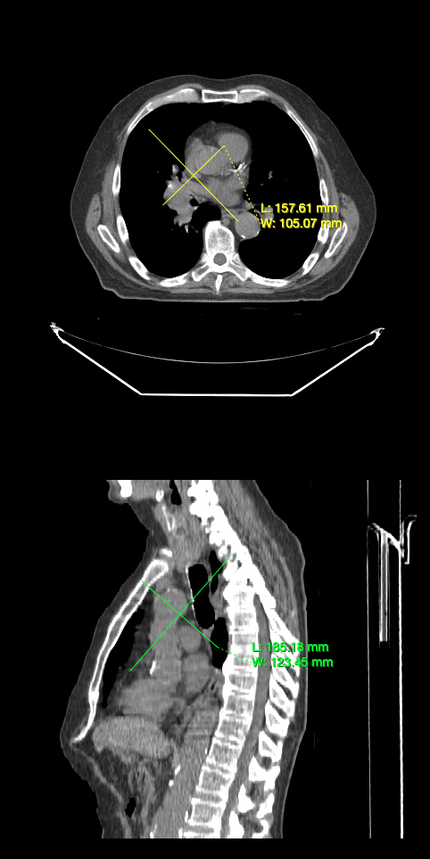

# 标注工具

本教程将演示如何使用标注工具进行标注。

## 前提 {#preface}

要完成本教程，我们需要：

- 初始化 cornerstone 及相关库
- 若干个 HTMLDivElement，用来显示体数据的不同方位（例如一个轴位、一个矢状位）
- 影像的路径（即 `imageId`）

## 实现 {#implementation}

**初始化 cornerstone 及相关库**

```js
import { init as coreInit } from '@cornerstonejs/core';
import { init as dicomImageLoaderInit } from '@cornerstonejs/dicom-image-loader';
import { init as cornerstoneToolsInit } from '@cornerstonejs/tools';

await coreInit();
await dicomImageLoaderInit();
await cornerstoneToolsInit();
```

为了本教程的演示，我们已经把影像放在了服务器上。

先创建两个 HTMLDivElement，并设置样式让它们容纳视口。

```js
const content = document.getElementById('content');

// 轴位视图的元素
const element1 = document.createElement('div');
element1.style.width = '500px';
element1.style.height = '500px';

// 矢状位视图的元素
const element2 = document.createElement('div');
element2.style.width = '500px';
element2.style.height = '500px';

content.appendChild(element1);
content.appendChild(element2);
```

接下来需要一个 `renderingEngine`。

```js
const renderingEngineId = 'myRenderingEngine';
const renderingEngine = new RenderingEngine(renderingEngineId);
```

加载体数据通过 `volumeLoader` API 完成。

```js
// 在内存中定义一份体数据
const volume = await volumeLoader.createAndCacheVolume(volumeId, { imageIds });
```

然后用 `setViewports` API 在渲染引擎里创建多个 `viewport`。

```js
const viewportId1 = 'CT_AXIAL';
const viewportId2 = 'CT_SAGITTAL';

const viewportInput = [
  {
    viewportId: viewportId1,
    element: element1,
    type: ViewportType.ORTHOGRAPHIC,
    defaultOptions: {
      orientation: Enums.OrientationAxis.AXIAL,
    },
  },
  {
    viewportId: viewportId2,
    element: element2,
    type: ViewportType.ORTHOGRAPHIC,
    defaultOptions: {
      orientation: Enums.OrientationAxis.SAGITTAL,
    },
  },
];

renderingEngine.setViewports(viewportInput);

await volume.load();
```

要使用工具，需要先通过 `addTool` API 把它们加入 `Cornerstone3DTools` 的内部状态。

```js
addTool(BidirectionalTool);
```

接着创建一个工具组，把想用的工具加进去。工具组让多个视口可以共享同一批工具，
所以还需要告诉工具组它应该作用在哪些视口上。

```js
const toolGroupId = 'myToolGroup';
const toolGroup = ToolGroupManager.createToolGroup(toolGroupId);

// 把工具加入工具组
toolGroup.addTool(BidirectionalTool.toolName);

toolGroup.addViewport(viewportId1, renderingEngineId);
toolGroup.addViewport(viewportId2, renderingEngineId);
```

:::note 提示

为什么要把 renderingEngineId 也传给工具组？因为 viewportId 只在单个渲染引擎内唯一。

:::

然后把工具设为 `Active（激活）`，这意味着还要为它定义绑定——也就是按哪个鼠标键时它生效。

```js
toolGroup.setToolActive(BidirectionalTool.toolName, {
  bindings: [
    {
      mouseButton: csToolsEnums.MouseBindings.Primary, // 左键
    },
  ],
});
```

最后加载体数据，并让视口显示它。

```js
setVolumesForViewports(
  renderingEngine,
  [
    {
      volumeId,
      callback: ({ volumeActor }) => {
        // volumeActor 创建完成后再设置窗宽窗位
        volumeActor
          .getProperty()
          .getRGBTransferFunction(0)
          .setMappingRange(-180, 220);
      },
    },
  ],
  [viewportId1, viewportId2]
);

// 渲染影像
renderingEngine.renderViewports([viewportId1, viewportId2]);
```

## 完整代码 {#final-code}

<details>
<summary>完整代码</summary>

```js
import {
  init as coreInit,
  RenderingEngine,
  Enums,
  volumeLoader,
  setVolumesForViewports,
} from '@cornerstonejs/core';
import { init as dicomImageLoaderInit } from '@cornerstonejs/dicom-image-loader';
import {
  init as cornerstoneToolsInit,
  ToolGroupManager,
  WindowLevelTool,
  ZoomTool,
  Enums as csToolsEnums,
  addTool,
  BidirectionalTool,
} from '@cornerstonejs/tools';
import { createImageIdsAndCacheMetaData } from '../../../../utils/demo/helpers';

const { ViewportType } = Enums;

const content = document.getElementById('content');

// 轴位视图的元素
const element1 = document.createElement('div');
element1.style.width = '500px';
element1.style.height = '500px';

// 矢状位视图的元素
const element2 = document.createElement('div');
element2.style.width = '500px';
element2.style.height = '500px';

content.appendChild(element1);
content.appendChild(element2);
// ============================= //

/**
 * 运行演示
 */
async function run() {
  await coreInit();
  await dicomImageLoaderInit();
  await cornerstoneToolsInit();

  const imageIds = await createImageIdsAndCacheMetaData({
    StudyInstanceUID:
      '1.3.6.1.4.1.14519.5.2.1.7009.2403.334240657131972136850343327463',
    SeriesInstanceUID:
      '1.3.6.1.4.1.14519.5.2.1.7009.2403.226151125820845824875394858561',
    wadoRsRoot: 'https://d14fa38qiwhyfd.cloudfront.net/dicomweb',
  });

  // 实例化一个渲染引擎
  const renderingEngineId = 'myRenderingEngine';
  const volumeId = 'myVolume';
  const renderingEngine = new RenderingEngine(renderingEngineId);
  const volume = await volumeLoader.createAndCacheVolume(volumeId, {
    imageIds,
  });
  const viewportId1 = 'CT_AXIAL';
  const viewportId2 = 'CT_SAGITTAL';

  const viewportInput = [
    {
      viewportId: viewportId1,
      element: element1,
      type: ViewportType.ORTHOGRAPHIC,
      defaultOptions: {
        orientation: Enums.OrientationAxis.AXIAL,
      },
    },
    {
      viewportId: viewportId2,
      element: element2,
      type: ViewportType.ORTHOGRAPHIC,
      defaultOptions: {
        orientation: Enums.OrientationAxis.SAGITTAL,
      },
    },
  ];

  renderingEngine.setViewports(viewportInput);

  await volume.load();

  addTool(BidirectionalTool);

  const toolGroupId = 'myToolGroup';
  const toolGroup = ToolGroupManager.createToolGroup(toolGroupId);

  // 把工具加入工具组
  toolGroup.addTool(BidirectionalTool.toolName);

  toolGroup.addViewport(viewportId1, renderingEngineId);
  toolGroup.addViewport(viewportId2, renderingEngineId);

  toolGroup.setToolActive(BidirectionalTool.toolName, {
    bindings: [
      {
        mouseButton: csToolsEnums.MouseBindings.Primary, // 左键
      },
    ],
  });

  setVolumesForViewports(
    renderingEngine,
    [
      {
        volumeId,
        callback: ({ volumeActor }) => {
          // volumeActor 创建完成后再设置窗宽窗位
          volumeActor
            .getProperty()
            .getRGBTransferFunction(0)
            .setMappingRange(-180, 220);
        },
      },
    ],
    [viewportId1, viewportId2]
  );

  // 渲染影像
  renderingEngine.renderViewports([viewportId1, viewportId2]);
}

run();
```

</details>

现在你应该可以用添加的工具在影像上做标注了。



## 延伸阅读 {#read-more}

进一步了解：

- [工具组（ToolGroup）](../1-concepts/cornerstone-tools/toolGroups.md)
- [标注](../1-concepts/cornerstone-tools/annotation/index.md)

标注工具的进阶用法，请访问
<a href="https://www.cornerstonejs.org/live-examples/volumeAnnotationTools.html" target="_blank">Volume Annotation Tools</a>
示例页面。

:::note 提示

- 到[示例](./examples.md#run-examples-locally)页面了解如何在本地运行这些示例。
- 调试示例的方法见[源码与调试](./examples.md#source-code-and-debugging)一节。

:::
