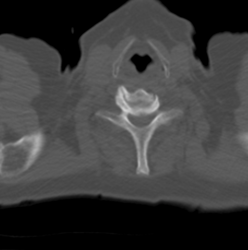

# 操作工具

本教程将演示如何添加一个缩放操作工具。

## 前提 {#preface}

要完成本教程，我们需要：

- 初始化各个库
- 一个 HTMLDivElement 用来显示视口
- 影像的路径（即 `imageId`）

## 实现 {#implementation}

**初始化 cornerstone 及相关库**

```js
import { init as coreInit } from '@cornerstonejs/core';
import { init as dicomImageLoaderInit } from '@cornerstonejs/dicom-image-loader';
import { init as cornerstoneToolsInit } from '@cornerstonejs/tools';

await coreInit();
await dicomImageLoaderInit();
await cornerstoneToolsInit();
```

为了本教程的演示，我们已经把影像放在了服务器上。

先创建一个 HTMLDivElement 并设置样式。

```js
const content = document.getElementById('content');

const element = document.createElement('div');

// 禁用默认的右键菜单
element.oncontextmenu = (e) => e.preventDefault();
element.style.width = '500px';
element.style.height = '500px';

content.appendChild(element);
```

接下来需要一个 `renderingEngine`。

```js
const renderingEngineId = 'myRenderingEngine';
const renderingEngine = new RenderingEngine(renderingEngineId);
```

这个例子用堆栈视口（StackViewport）就够了。

```js
const viewportId = 'CT_AXIAL_STACK';

const viewportInput = {
  viewportId,
  element,
  type: ViewportType.STACK,
};

renderingEngine.enableElement(viewportInput);
```

视口的创建由渲染引擎负责。我们可以取到视口对象并把影像设置上去。

```js
const viewport = renderingEngine.getViewport(viewportId);

viewport.setStack(imageIds);

viewport.render();
```

要使用操作工具，需要先通过 `addTool` API 把它们加入 `Cornerstone3DTools` 的内部状态。

```js
addTool(ZoomTool);
addTool(WindowLevelTool);
```

接着创建一个工具组，把想用的工具加进去。工具组让多个视口可以共享同一批工具，
所以还需要告诉工具组它应该作用在哪些视口上。

```js
const toolGroupId = 'myToolGroup';
const toolGroup = ToolGroupManager.createToolGroup(toolGroupId);

toolGroup.addTool(ZoomTool.toolName);
toolGroup.addTool(WindowLevelTool.toolName);

toolGroup.addViewport(viewportId, renderingEngineId);
```

:::note 提示

为什么要把 renderingEngineId 也传给工具组？因为 viewportId 只在单个渲染引擎内唯一。

:::

然后把工具设为 `Active（激活）`，这意味着还要为它定义绑定——也就是按哪个鼠标键时它生效。

```js
// 鼠标左键按下时激活窗宽窗位工具
toolGroup.setToolActive(WindowLevelTool.toolName, {
  bindings: [
    {
      mouseButton: csToolsEnums.MouseBindings.Primary, // 左键
    },
  ],
});

toolGroup.setToolActive(ZoomTool.toolName, {
  bindings: [
    {
      mouseButton: csToolsEnums.MouseBindings.Secondary, // 右键
    },
  ],
});
```

## 完整代码 {#final-code}

<details>
<summary>完整代码</summary>

```js
import { init as coreInit, RenderingEngine, Enums } from '@cornerstonejs/core';
import { init as dicomImageLoaderInit } from '@cornerstonejs/dicom-image-loader';
import {
  init as cornerstoneToolsInit,
  ToolGroupManager,
  WindowLevelTool,
  ZoomTool,
  Enums as csToolsEnums,
  addTool,
} from '@cornerstonejs/tools';
import { createImageIdsAndCacheMetaData } from '../../../../utils/demo/helpers';

const { ViewportType } = Enums;

const content = document.getElementById('content');

const element = document.createElement('div');

// 禁用默认的右键菜单
element.oncontextmenu = (e) => e.preventDefault();
element.style.width = '500px';
element.style.height = '500px';

content.appendChild(element);
// ============================= //

/**
 * 运行演示
 */
async function run() {
  await coreInit();
  await dicomImageLoaderInit();
  await cornerstoneToolsInit();

  const imageIds = await createImageIdsAndCacheMetaData({
    StudyInstanceUID:
      '1.3.6.1.4.1.14519.5.2.1.7009.2403.334240657131972136850343327463',
    SeriesInstanceUID:
      '1.3.6.1.4.1.14519.5.2.1.7009.2403.226151125820845824875394858561',
    wadoRsRoot: 'https://d14fa38qiwhyfd.cloudfront.net/dicomweb',
  });

  // 实例化一个渲染引擎
  const renderingEngineId = 'myRenderingEngine';
  const renderingEngine = new RenderingEngine(renderingEngineId);

  const viewportId = 'CT_AXIAL_STACK';

  const viewportInput = {
    viewportId,
    element,
    type: ViewportType.STACK,
  };

  renderingEngine.enableElement(viewportInput);

  const viewport = renderingEngine.getViewport(viewportId);

  viewport.setStack(imageIds);

  viewport.render();

  const toolGroupId = 'myToolGroup';
  const toolGroup = ToolGroupManager.createToolGroup(toolGroupId);

  addTool(ZoomTool);
  addTool(WindowLevelTool);
  toolGroup.addTool(ZoomTool.toolName);
  toolGroup.addTool(WindowLevelTool.toolName);

  toolGroup.addViewport(viewportId);

  toolGroup.setToolActive(WindowLevelTool.toolName, {
    bindings: [
      {
        mouseButton: csToolsEnums.MouseBindings.Primary, // 左键
      },
    ],
  });

  toolGroup.setToolActive(ZoomTool.toolName, {
    bindings: [
      {
        mouseButton: csToolsEnums.MouseBindings.Secondary, // 右键
      },
    ],
  });
  viewport.render();
}

run();
```

</details>



## 延伸阅读 {#read-more}

进一步了解：

- [工具组（ToolGroup）](../1-concepts/cornerstone-tools/toolGroups.md)
- [工具](../1-concepts/cornerstone-tools/tools.md)
