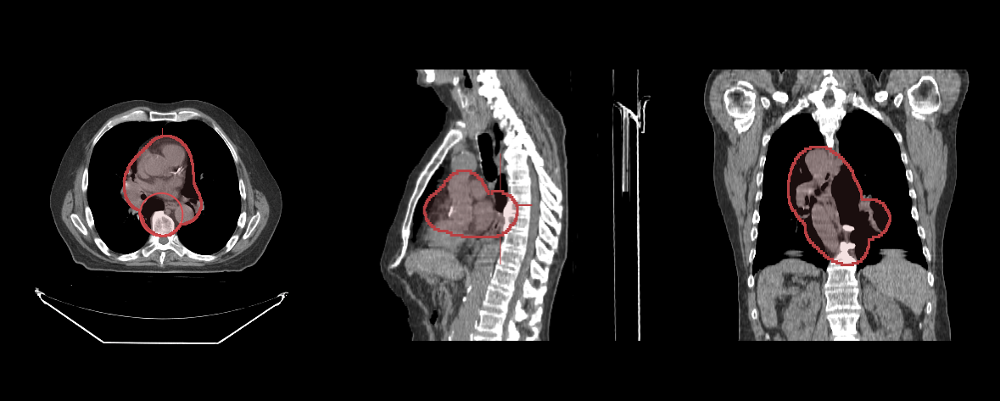

# 分割工具

本教程将演示如何使用分割工具绘制和编辑分割。

## 前提 {#preface}

要完成本教程，我们需要：

- 初始化 cornerstone 及相关库
- 若干个 HTMLDivElement，用来显示体数据的不同方位（例如一个轴位、一个矢状位）
- 影像的路径（即 `imageId`）

## 实现 {#implementation}

**初始化 cornerstone 及相关库**

```js
import { init as coreInit } from '@cornerstonejs/core';
import { init as dicomImageLoaderInit } from '@cornerstonejs/dicom-image-loader';
import { init as cornerstoneToolsInit } from '@cornerstonejs/tools';

await coreInit();
await dicomImageLoaderInit();
await cornerstoneToolsInit();
```

为了本教程的演示，我们已经把影像放在了服务器上。

先创建三个 HTMLDivElement 并设置样式，分别用于轴位、矢状位和冠状位视图。

```js
const content = document.getElementById('content');

const viewportGrid = document.createElement('div');
viewportGrid.style.display = 'flex';
viewportGrid.style.flexDirection = 'row';

// 轴位视图的元素
const element1 = document.createElement('div');
element1.style.width = '500px';
element1.style.height = '500px';

// 矢状位视图的元素
const element2 = document.createElement('div');
element2.style.width = '500px';
element2.style.height = '500px';

// 冠状位视图的元素
const element3 = document.createElement('div');
element3.style.width = '500px';
element3.style.height = '500px';

viewportGrid.appendChild(element1);
viewportGrid.appendChild(element2);
viewportGrid.appendChild(element3);

content.appendChild(viewportGrid);
```

笔刷工具用的是 `BrushTool`。这些工具都需要通过 `addTool` API 加入 `Cornerstone3D`，
再加入工具组：

```js
addTool(BrushTool);
```

工具组部分：

```js
const toolGroupId = 'CT_TOOLGROUP';
// 定义工具组，用于承载分割显示相关的工具
const toolGroup = ToolGroupManager.createToolGroup(toolGroupId);

// 分割工具
toolGroup.addTool(BrushTool.toolName);
```

要让笔刷工具在按下鼠标左键时生效，把 `BrushTool` 设为 `Active（激活）`：

```js
toolGroup.setToolActive(BrushTool.toolName, {
  bindings: [{ mouseButton: csToolsEnums.MouseBindings.Primary }],
});
```

接下来处理体数据的加载。先加载我们打算用来渲染的那份 CT 体数据。

```js
const volumeName = 'CT_VOLUME_ID';
const volumeId = `${volumeName}`;

// 在内存中为 CT 定义一份体数据
const volume = await volumeLoader.createAndCacheVolume(volumeId, {
  imageIds,
});
```

分割还需要另一份体数据（我们不希望为了分割去改动 CT 体数据本身）。
可以把 CT 体数据（`volumeId`）作为元数据参考，派生出一份新的体数据用于分割。

```js
const segmentationId = 'MY_SEGMENTATION_ID';

// 创建一份与 CT 源数据分辨率相同的分割
volumeLoader.createAndCacheDerivedLabelmapVolume(volumeId, {
  volumeId: segmentationId,
});
```

然后把创建好的分割加入 `Cornerstone3DTools` 的分割状态，这一步用 `addSegmentation` API 完成：

```js
// 把分割加入状态。可以看到，作为标签图数据的
// 那个已缓存的 volumeId 被传进了状态里
segmentation.addSegmentations([
  {
    segmentationId,
    representation: {
      // 分割的类型
      type: csToolsEnums.SegmentationRepresentations.Labelmap,
      // 实际的分割数据。对标签图来说，这里是
      // 指向该分割源体数据的引用。
      data: {
        volumeId: segmentationId,
      },
    },
  },
]);
```

:::note Important
创建分割并把它加入 `Cornerstone3DTools` 的分割状态，并不等于把它渲染到视口上。
`Cornerstone3DTools` 把 `分割` 与 `分割表示形式` 解耦了。简单来说，`分割` 持有渲染
各种 `分割表示形式`（例如 `标签图`、`轮廓`——轮廓暂未支持，见路线图）所需的数据。
所以同一份 `分割` 可以有多个 `表示形式`。本教程末尾有更多说明。
:::

下面创建渲染引擎、添加视口，并把视口告知工具组：

```js
// 实例化一个渲染引擎
const renderingEngineId = 'myRenderingEngine';
const renderingEngine = new RenderingEngine(renderingEngineId);

// 创建视口
const viewportId1 = 'CT_AXIAL';
const viewportId2 = 'CT_SAGITTAL';
const viewportId3 = 'CT_CORONAL';

const viewportInputArray = [
  {
    viewportId: viewportId1,
    type: ViewportType.ORTHOGRAPHIC,
    element: element1,
    defaultOptions: {
      orientation: Enums.OrientationAxis.AXIAL,
    },
  },
  {
    viewportId: viewportId2,
    type: ViewportType.ORTHOGRAPHIC,
    element: element2,
    defaultOptions: {
      orientation: Enums.OrientationAxis.SAGITTAL,
    },
  },
  {
    viewportId: viewportId3,
    type: ViewportType.ORTHOGRAPHIC,
    element: element3,
    defaultOptions: {
      orientation: Enums.OrientationAxis.CORONAL,
    },
  },
];

renderingEngine.setViewports(viewportInputArray);

toolGroup.addViewport(viewportId1, renderingEngineId);
toolGroup.addViewport(viewportId2, renderingEngineId);
toolGroup.addViewport(viewportId3, renderingEngineId);
```

开始加载体数据，并把它设置到视口上：

```js
// 开始加载体数据
await volume.load();

// 把体数据设置到视口上
await setVolumesForViewports(
  renderingEngine,
  [
    {
      volumeId,
      callback: ({ volumeActor }) => {
        // volumeActor 创建完成后再设置窗宽窗位
        volumeActor
          .getProperty()
          .getRGBTransferFunction(0)
          .setMappingRange(-180, 220);
      },
    },
  ],
  [viewportId1, viewportId2, viewportId3]
);
```

最后，创建该分割的标签图表示形式并加入工具组：

```js
await segmentation.addLabelmapRepresentationToViewportMap({
  [viewportId1]: [
    {
      segmentationId,
      type: csToolsEnums.SegmentationRepresentations.Labelmap,
    },
  ],
  [viewportId2]: [
    {
      segmentationId,
      type: csToolsEnums.SegmentationRepresentations.Labelmap,
    },
  ],
  [viewportId3]: [
    {
      segmentationId,
      type: csToolsEnums.SegmentationRepresentations.Labelmap,
    },
  ],
});

// 渲染影像
renderingEngine.render();
```

## 完整代码 {#final-code}

<details>
<summary>完整代码</summary>

```js
import {
  init as coreInit,
  RenderingEngine,
  Enums,
  volumeLoader,
  setVolumesForViewports,
} from '@cornerstonejs/core';
import { init as dicomImageLoaderInit } from '@cornerstonejs/dicom-image-loader';
import {
  init as cornerstoneToolsInit,
  ToolGroupManager,
  Enums as csToolsEnums,
  addTool,
  BidirectionalTool,
  BrushTool,
  segmentation,
} from '@cornerstonejs/tools';
import { createImageIdsAndCacheMetaData } from '../../../../utils/demo/helpers';

const { ViewportType } = Enums;

const content = document.getElementById('content');

const viewportGrid = document.createElement('div');
viewportGrid.style.display = 'flex';
viewportGrid.style.flexDirection = 'row';

// 轴位视图的元素
const element1 = document.createElement('div');
element1.style.width = '500px';
element1.style.height = '500px';

// 矢状位视图的元素
const element2 = document.createElement('div');
element2.style.width = '500px';
element2.style.height = '500px';

// 冠状位视图的元素
const element3 = document.createElement('div');
element3.style.width = '500px';
element3.style.height = '500px';

viewportGrid.appendChild(element1);
viewportGrid.appendChild(element2);
viewportGrid.appendChild(element3);

content.appendChild(viewportGrid);
// ============================= //

/**
 * 运行演示
 */
async function run() {
  await coreInit();
  await dicomImageLoaderInit();
  await cornerstoneToolsInit();

  const imageIds = await createImageIdsAndCacheMetaData({
    StudyInstanceUID:
      '1.3.6.1.4.1.14519.5.2.1.7009.2403.334240657131972136850343327463',
    SeriesInstanceUID:
      '1.3.6.1.4.1.14519.5.2.1.7009.2403.226151125820845824875394858561',
    wadoRsRoot: 'https://d14fa38qiwhyfd.cloudfront.net/dicomweb',
  });

  // 实例化一个渲染引擎
  const renderingEngineId = 'myRenderingEngine';

  addTool(BrushTool);

  const toolGroupId = 'CT_TOOLGROUP';
  // 定义工具组，用于承载分割显示相关的工具
  const toolGroup = ToolGroupManager.createToolGroup(toolGroupId);

  // 分割工具
  toolGroup.addTool(BrushTool.toolName);

  toolGroup.setToolActive(BrushTool.toolName, {
    bindings: [{ mouseButton: csToolsEnums.MouseBindings.Primary }],
  });

  const volumeName = 'CT_VOLUME_ID';
  const volumeId = `${volumeName}`;

  // 在内存中为 CT 定义一份体数据
  const volume = await volumeLoader.createAndCacheVolume(volumeId, {
    imageIds,
  });

  const segmentationId = 'MY_SEGMENTATION_ID';

  // 创建一份与 CT 源数据分辨率相同的分割
  volumeLoader.createAndCacheDerivedLabelmapVolume(volumeId, {
    volumeId: segmentationId,
  });

  segmentation.addSegmentations([
    {
      segmentationId,
      representation: {
        // 分割的类型
        type: csToolsEnums.SegmentationRepresentations.Labelmap,
        // 实际的分割数据。对标签图来说，这里是
        // 指向该分割源体数据的引用。
        data: {
          volumeId: segmentationId,
        },
      },
    },
  ]);

  // 创建视口
  const viewportId1 = 'CT_AXIAL';
  const viewportId2 = 'CT_SAGITTAL';
  const viewportId3 = 'CT_CORONAL';

  const viewportInputArray = [
    {
      viewportId: viewportId1,
      type: ViewportType.ORTHOGRAPHIC,
      element: element1,
      defaultOptions: {
        orientation: Enums.OrientationAxis.AXIAL,
      },
    },
    {
      viewportId: viewportId2,
      type: ViewportType.ORTHOGRAPHIC,
      element: element2,
      defaultOptions: {
        orientation: Enums.OrientationAxis.SAGITTAL,
      },
    },
    {
      viewportId: viewportId3,
      type: ViewportType.ORTHOGRAPHIC,
      element: element3,
      defaultOptions: {
        orientation: Enums.OrientationAxis.CORONAL,
      },
    },
  ];

  const renderingEngine = new RenderingEngine(renderingEngineId);
  renderingEngine.setViewports(viewportInputArray);

  toolGroup.addViewport(viewportId1, renderingEngineId);
  toolGroup.addViewport(viewportId2, renderingEngineId);
  toolGroup.addViewport(viewportId3, renderingEngineId);

  // 开始加载体数据
  await volume.load();

  // 把体数据设置到视口上
  await setVolumesForViewports(
    renderingEngine,
    [
      {
        volumeId,
        callback: ({ volumeActor }) => {
          // volumeActor 创建完成后再设置窗宽窗位
          volumeActor
            .getProperty()
            .getRGBTransferFunction(0)
            .setMappingRange(-180, 220);
        },
      },
    ],
    [viewportId1, viewportId2, viewportId3]
  );

  await segmentation.addLabelmapRepresentationToViewportMap({
    [viewportId1]: [
      {
        segmentationId,
        type: csToolsEnums.SegmentationRepresentations.Labelmap,
      },
    ],
    [viewportId2]: [
      {
        segmentationId,
        type: csToolsEnums.SegmentationRepresentations.Labelmap,
      },
    ],
    [viewportId3]: [
      {
        segmentationId,
        type: csToolsEnums.SegmentationRepresentations.Labelmap,
      },
    ],
  });

  // 渲染影像
  renderingEngine.render();
}

run();
```

</details>

现在你应该可以用笔刷工具绘制分割了。



## 延伸阅读 {#read-more}

进一步了解：

- [分割](../1-concepts/cornerstone-tools/segmentation/index.md)
- [分割工具](../1-concepts/cornerstone-tools/segmentation/segmentation-tools.md)

:::note 提示

- 到[示例](./examples.md#run-examples-locally)页面了解如何在本地运行这些示例。
- 调试示例的方法见[源码与调试](./examples.md#source-code-and-debugging)一节。

:::
