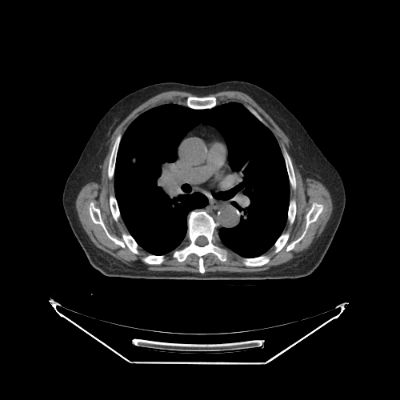

# 渲染一组堆栈影像

本教程将演示如何渲染一组堆栈影像。

## 前提

要渲染一组影像，我们需要：

- 执行各个库的初始化函数
- 一个 `element`（HTMLDivElement）作为视口的容器
- 影像的路径（即 `imageId`）

## 实现

为了本教程的演示，我们已经把影像放在了服务器上。

1. 初始化各个库

```js
import { init as coreInit } from '@cornerstonejs/core';
import { init as dicomImageLoaderInit } from '@cornerstonejs/dicom-image-loader';

await coreInit();
await dicomImageLoaderInit();
```

2. 创建一个 HTML 元素，并把它的样式设置成视口的样子。

```js
const content = document.getElementById('content');
const element = document.createElement('div');

element.style.width = '500px';
element.style.height = '500px';

content.appendChild(element);
```

接下来需要一个 `renderingEngine`（渲染引擎）和一个 `viewport`（视口）来渲染影像。

```js
const renderingEngineId = 'myRenderingEngine';
const renderingEngine = new RenderingEngine(renderingEngineId);
```

然后就可以用 `enableElement` API 在渲染引擎里创建一个 `viewport`。
注意，本教程不打算渲染体数据，所以把视口类型指定为 `Stack`。

```js
const viewportId = 'CT_AXIAL_STACK';

const viewportInput = {
  viewportId,
  element,
};

renderingEngine.enableElement(viewportInput);
```

视口的创建由渲染引擎负责。我们可以取到视口对象，把影像设置到它上面，
并指定要显示第几张影像。

:::info
这里用到的 imageId 是通过 `createImageIdsAndCacheMetaData` 函数生成的。

```js
const imageIds = await createImageIdsAndCacheMetaData({
  StudyInstanceUID:
    '1.3.6.1.4.1.14519.5.2.1.7009.2403.334240657131972136850343327463',
  SeriesInstanceUID:
    '1.3.6.1.4.1.14519.5.2.1.7009.2403.226151125820845824875394858561',
  wadoRsRoot: 'https://d14fa38qiwhyfd.cloudfront.net/dicomweb',
});
```

:::

```js
const viewport = renderingEngine.getViewport(viewportId);

viewport.setStack(imageIds, 60);

viewport.render();
```

:::note 提示
由于 imageIds 是一个 imageId 数组，可以用 `setStack` 的第二个参数指定显示其中的哪一张。
:::

## 完整代码

<details>
<summary>完整代码</summary>

```js
import { RenderingEngine, Enums, init as coreInit } from '@cornerstonejs/core';
import { init as dicomImageLoaderInit } from '@cornerstonejs/dicom-image-loader';
import { createImageIdsAndCacheMetaData } from '../../../../utils/demo/helpers';

const content = document.getElementById('content');
const element = document.createElement('div');

element.style.width = '500px';
element.style.height = '500px';

content.appendChild(element);
// ============================= //

/**
 * 运行演示
 */
async function run() {
  await coreInit();
  await dicomImageLoaderInit();

  // 获取 Cornerstone 的 imageId，并把元数据取到内存中
  const imageIds = await createImageIdsAndCacheMetaData({
    StudyInstanceUID:
      '1.3.6.1.4.1.14519.5.2.1.7009.2403.334240657131972136850343327463',
    SeriesInstanceUID:
      '1.3.6.1.4.1.14519.5.2.1.7009.2403.226151125820845824875394858561',
    wadoRsRoot: 'https://d14fa38qiwhyfd.cloudfront.net/dicomweb',
  });

  const renderingEngineId = 'myRenderingEngine';
  const renderingEngine = new RenderingEngine(renderingEngineId);

  const viewportId = 'CT_AXIAL_STACK';

  const viewportInput = {
    viewportId,
    element,
    type: Enums.ViewportType.STACK,
  };

  renderingEngine.enableElement(viewportInput);

  const viewport = renderingEngine.getViewport(viewportId);

  viewport.setStack(imageIds, 60);

  viewport.render();
}

run();
```

</details>

你应该会看到这样的结果：



## 延伸阅读

进一步了解：

- [影像 ID（imageId）](../1-concepts/cornerstone-core/imageId.md)
- [渲染引擎](../1-concepts/cornerstone-core/renderingEngine.md)
- [视口](../1-concepts/cornerstone-core/viewports.md)

堆栈视口的进阶用法，请访问
<a href="https://www.cornerstonejs.org/live-examples/stackapi" target="_blank">StackViewport API</a>
示例页面。

:::note 提示

- 到[示例](./examples.md)页面了解如何在本地运行这些示例。

:::
