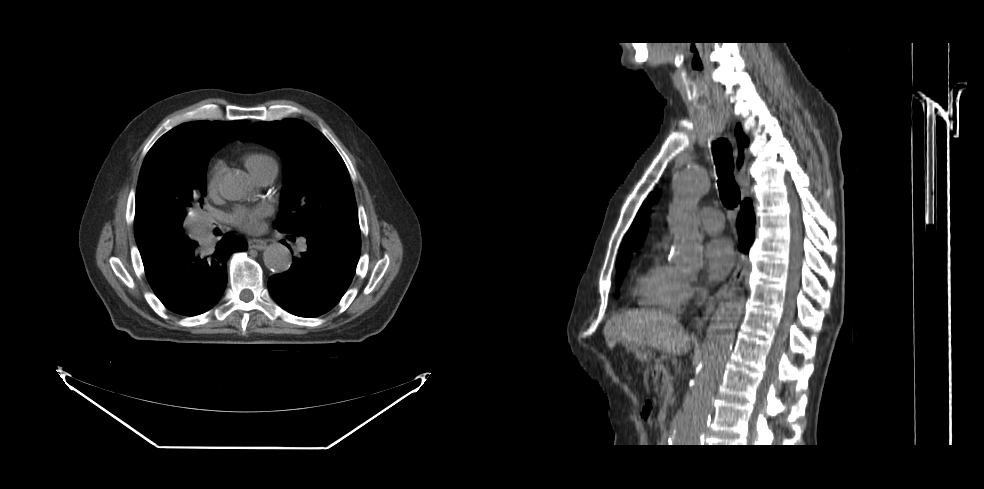

# 渲染体数据

本教程将演示如何渲染体数据。

## 前提

要渲染体数据，我们需要：

- 初始化 cornerstone 及相关库
- 若干个 HTMLDivElement，用来显示体数据的不同方位（例如一个轴位、一个矢状位）
- 影像的路径（即 `imageId`）

## 实现

### 第 1 步：初始化 cornerstone 及相关库

```js
import { init as coreInit } from '@cornerstonejs/core';
import { init as dicomImageLoaderInit } from '@cornerstonejs/dicom-image-loader';

await coreInit();
await dicomImageLoaderInit();
```

为了本教程的演示，我们已经把影像放在了服务器上。

先创建两个 HTMLDivElement，并设置样式让它们容纳视口。

```js
const content = document.getElementById('content');

const viewportGrid = document.createElement('div');
viewportGrid.style.display = 'flex';
viewportGrid.style.flexDirection = 'row';

// 轴位视图的元素
const element1 = document.createElement('div');
element1.style.width = '500px';
element1.style.height = '500px';

// 矢状位视图的元素
const element2 = document.createElement('div');
element2.style.width = '500px';
element2.style.height = '500px';

viewportGrid.appendChild(element1);
viewportGrid.appendChild(element2);

content.appendChild(viewportGrid);
```

接下来需要一个 `renderingEngine`。

```js
const renderingEngineId = 'myRenderingEngine';
const renderingEngine = new RenderingEngine(renderingEngineId);
```

加载体数据通过 `volumeLoader` API 完成。

```js
const volumeId = 'myVolume';

// 在内存中定义一份体数据
const volume = await volumeLoader.createAndCacheVolume(volumeId, { imageIds });
```

然后用 `setViewports` API 在渲染引擎里创建多个 `viewport`。

```js
const viewportId1 = 'CT_AXIAL';
const viewportId2 = 'CT_SAGITTAL';

const viewportInput = [
  {
    viewportId: viewportId1,
    element: element1,
    type: ViewportType.ORTHOGRAPHIC,
    defaultOptions: {
      orientation: Enums.OrientationAxis.AXIAL,
    },
  },
  {
    viewportId: viewportId2,
    element: element2,
    type: ViewportType.ORTHOGRAPHIC,
    defaultOptions: {
      orientation: Enums.OrientationAxis.SAGITTAL,
    },
  },
];

renderingEngine.setViewports(viewportInput);
```

视口的创建由渲染引擎负责。接下来需要对体数据执行 `load`。

:::note Important
定义一份体数据和加载它是两件不同的事。
:::

```js
// 开始加载体数据
volume.load();
```

最后，把体数据告知这些视口。

```js
setVolumesForViewports(
  renderingEngine,
  [{ volumeId }],
  [viewportId1, viewportId2]
);

// 渲染影像
renderingEngine.renderViewports([viewportId1, viewportId2]);
```

## 完整代码

<details>
<summary>点击查看完整代码</summary>

```js
import {
  init as coreInit,
  RenderingEngine,
  Enums,
  volumeLoader,
  setVolumesForViewports,
} from '@cornerstonejs/core';
import { init as dicomImageLoaderInit } from '@cornerstonejs/dicom-image-loader';
import { createImageIdsAndCacheMetaData } from '../../../../utils/demo/helpers';

const { ViewportType } = Enums;

const content = document.getElementById('content');

const viewportGrid = document.createElement('div');
viewportGrid.style.display = 'flex';
viewportGrid.style.flexDirection = 'row';

// 轴位视图的元素
const element1 = document.createElement('div');
element1.style.width = '500px';
element1.style.height = '500px';

// 矢状位视图的元素
const element2 = document.createElement('div');
element2.style.width = '500px';
element2.style.height = '500px';

viewportGrid.appendChild(element1);
viewportGrid.appendChild(element2);

content.appendChild(viewportGrid);
// ============================= //

async function run() {
  await coreInit();
  await dicomImageLoaderInit();

  // 获取 Cornerstone 的 imageId，并把元数据取到内存中
  const imageIds = await createImageIdsAndCacheMetaData({
    StudyInstanceUID:
      '1.3.6.1.4.1.14519.5.2.1.7009.2403.334240657131972136850343327463',
    SeriesInstanceUID:
      '1.3.6.1.4.1.14519.5.2.1.7009.2403.226151125820845824875394858561',
    wadoRsRoot: 'https://d14fa38qiwhyfd.cloudfront.net/dicomweb',
  });

  // 实例化一个渲染引擎
  const renderingEngineId = 'myRenderingEngine';
  const renderingEngine = new RenderingEngine(renderingEngineId);

  const volumeId = 'myVolume';

  // 在内存中定义一份体数据
  const volume = await volumeLoader.createAndCacheVolume(volumeId, {
    imageIds,
  });

  const viewportId1 = 'CT_AXIAL';
  const viewportId2 = 'CT_SAGITTAL';

  const viewportInput = [
    {
      viewportId: viewportId1,
      element: element1,
      type: ViewportType.ORTHOGRAPHIC,
      defaultOptions: {
        orientation: Enums.OrientationAxis.AXIAL,
      },
    },
    {
      viewportId: viewportId2,
      element: element2,
      type: ViewportType.ORTHOGRAPHIC,
      defaultOptions: {
        orientation: Enums.OrientationAxis.SAGITTAL,
      },
    },
  ];

  renderingEngine.setViewports(viewportInput);

  volume.load();

  setVolumesForViewports(
    renderingEngine,
    [{ volumeId }],
    [viewportId1, viewportId2]
  );
}

run();
```

</details>

你应该能看到这样的结果：

<div style={{width:"75%"}}>



</div>

## 延伸阅读

进一步了解：

- [体数据](../1-concepts/cornerstone-core/volumes.md)
- [渲染引擎](../1-concepts/cornerstone-core/renderingEngine.md)
- [视口](../1-concepts/cornerstone-core/viewports.md)

体数据视口的进阶用法，请访问
<a href="https://www.cornerstonejs.org/live-examples/volumeAPI.html" target="_blank">VolumeViewport API</a>
示例页面。

:::note 提示

- 到[示例](./examples.md)页面了解如何在本地运行这些示例。

:::
