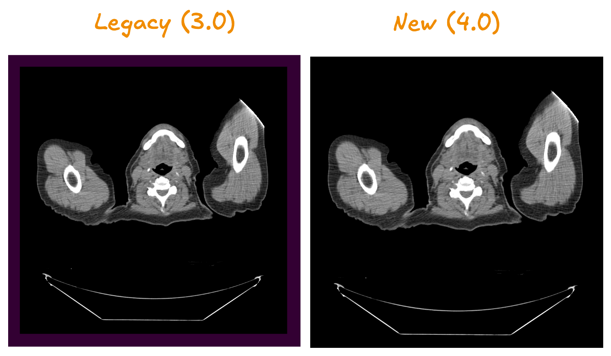

# 相机视野的变化 {#camera-field-of-view-changes}

## 变化内容 {#what-changed}

在 4.x 版本中，影像在视口里会铺满到边缘，不再有 3.x 中那 10% 的留白。

### 视觉差异 {#visual-difference}

- **之前（3.x）**：影像四周有自动留白（背景色可配置）
- **之后（4.x）**：影像铺满整个视口



## 如何恢复旧行为 {#how-to-revert}

如果你需要带留白的旧行为，在初始化时加上这项配置：

```javascript
import { init } from '@cornerstonejs/core';

init({
  rendering: {
    useLegacyCameraFOV: true,
  },
});
```

就这么简单。你的影像会像 3.x 那样带留白显示。

## 为什么要做这项改动 {#why-we-changed-this}

新的做法能更充分地利用屏幕，全宽显示也更准确——
这对现代高分辨率显示器和移动设备尤其重要。
