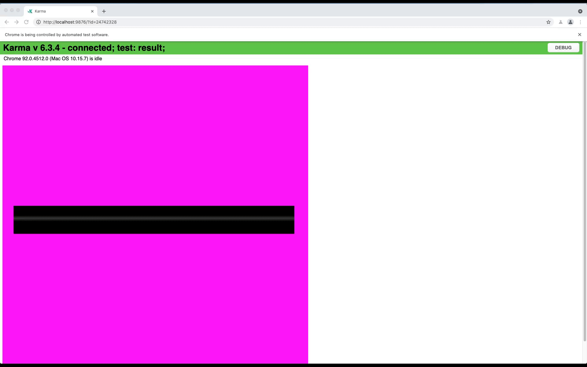

# 编写 Karma 测试

为了确保我们的渲染和工具在将来的修改中不会出错，我们为它们编写了测试。渲染测试包括将渲染的图像与预期图像进行比较。工具测试包括将工具的输出与预期输出进行比较。

### 本地运行 Karma 测试

您可以运行 `yarn run test` 来在本地运行所有测试。
默认情况下，`karma.conf.js` 会在无头 Chrome 浏览器中运行测试，以确保我们的测试可以在任何服务器中运行。因此，默认情况下您无法看到它。为了运行测试并可视化检查结果，您可以通过将 `karma.conf.js` 文件中的 `browsers: ['ChromeHeadless']` 改为 `browsers: ['Chrome']` 来运行测试。

### 仅在本地运行一个 Karma 测试

您可以使用 `karma` 的说明符，例如 `describe` 而不是（`describe`）和 `fit` 而不是（`it`）来只运行一个测试。