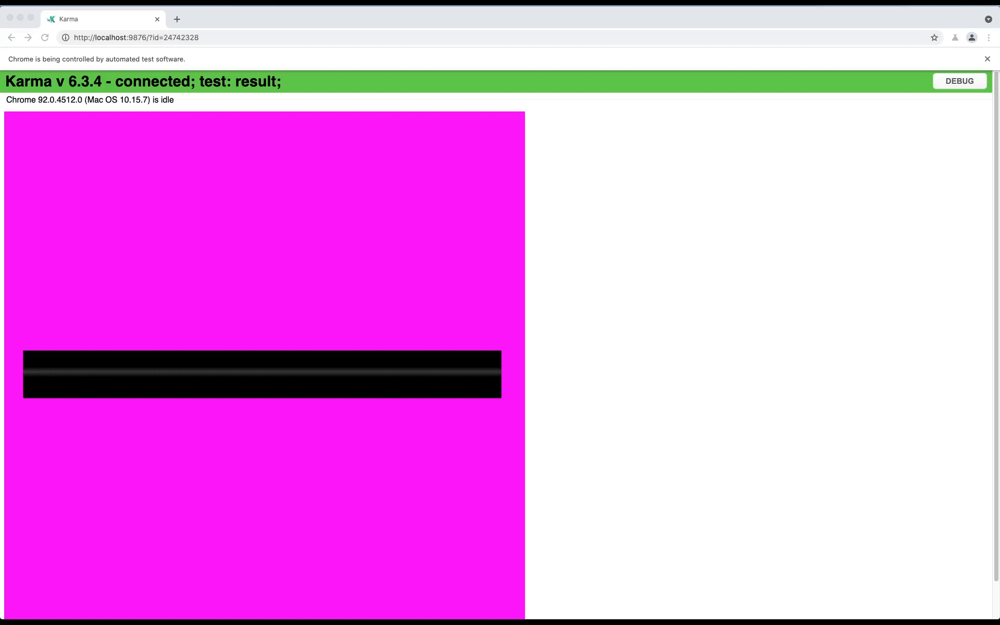

# 编写 Karma 测试 {#writing-karma-tests}

为了确保渲染和工具不会在后续改动中被破坏，我们为它们写了测试。
渲染测试的做法是把渲染出来的图片与预期图片做比对；
工具测试则是把工具的输出与预期输出做比对。

### 在本地运行 Karma 测试 {#running-karma-tests-locally}

执行 `yarn run test` 就能在本地跑全部测试。
默认情况下，`karma.conf.js` 会在无头 Chrome 中运行测试，
以确保我们的测试能在任何服务器上跑起来——因此默认是看不到画面的。
如果想一边跑测试一边用眼睛看结果，可以把 `karma.conf.js` 里的
`browsers: ['ChromeHeadless']` 改成 `browsers: ['Chrome']`。



### 生成 HTML 审阅报告 {#generating-html-review-reports}

本地审阅时，请使用仓库提供的包装脚本，而不是只看终端输出：

```bash
./scripts/run-karma.sh
./scripts/run-karma.sh --compat
./scripts/run-karma.sh --cpu
./scripts/run-karma.sh --next
```

这个包装脚本会运行 `npx karma start --single-run`、捕获日志，
并在 `reports/` 下生成带时间戳的产物。

例如：

```bash
reports/legacy-karma/<timestamp>/legacy-karma.log
reports/legacy-karma-<timestamp>/index.html
reports/compat-karma/<timestamp>/compat-karma.log
reports/compat-cpu-karma/<timestamp>/compat-cpu-karma.log
```

该包装脚本支持的标志：

- `--compat`：强制本次 Karma 运行使用兼容模式。
- `--cpu`：强制本次 Karma 运行使用 CPU 渲染。
- `--next`：便捷模式，会跑两轮——先 `--compat`，再 `--compat --cpu`。

其余参数会被直接透传给 `karma start`，
所以你仍然可以照常使用 Karma 的 CLI 选项：

```bash
./scripts/run-karma.sh --browsers Chrome --no-single-run
./scripts/run-karma.sh --reporters spec
```

有用的环境变量：

- `KARMA_GREP="<pattern>"`：通过 Karma 的 client 参数筛选测试。
- `KARMA_PACKAGE=core|tools`：只加载所选那个包的 Karma 测试。
- `FORCE_COMPAT=true` 和 `FORCE_CPU_RENDERING=true`：
  不走包装脚本、直接运行 `karma start` 时用来强制覆盖设置。

例如：

```bash
./scripts/run-karma.sh
./scripts/run-karma.sh --compat
./scripts/run-karma.sh --compat --browsers Chrome --no-single-run
KARMA_GREP="flip a stack viewport vertically" ./scripts/run-karma.sh --browsers Chrome --no-single-run
KARMA_PACKAGE=core ./scripts/run-karma.sh
```

### 基线图片 {#baseline-images}

Karma 会依据模式使用两处不同的基线位置：

- 旧版（legacy）模式与已提交在 `packages/core/test/groundTruth/`
  和 `packages/tools/test/groundTruth/` 中的 PNG 做比对。
- 兼容模式（compatibility-mode）的运行使用 `karma-baselines/<mode>/`
  下生成出来的 PNG。

要刷新已提交的旧版基准图片，执行：

```bash
node utils/updateGroundTruth.js
```

兼容模式的基线行为有所不同：

- 缺失的基线会在 `./scripts/run-karma.sh` 运行结束后自动创建。
- 新的兼容模式基线创建之后，需要**再跑一次**同样的命令，才会与它做比对。
- 如果你有意要替换某个已有的兼容模式基线，
  就删除或覆盖 `karma-baselines/` 中对应的那个 PNG，然后重新运行该包装脚本。

### 审阅图片比对结果 {#reviewing-image-comparisons}

当 Karma 测试用到 `compareImages()` 时，HTML 报告会持久化保存图片产物供审阅。
现在通过和失败的图片比对**都会**保存，而不只是失败的。

对每一份比对产物，报告会展示：

- `Expected`（预期）
- `Actual`（实际）
- `Compare`（对比）
- `Diff Mask`（差异掩膜）

`Compare` 面板会用一个滑块把预期与实际叠在一起对照，
并且每个图块都带有直接打开的链接，方便你在新标签页里查看原始生成图片。

该 HTML 报告还支持按状态筛选，并且失败的测试会排在报告最前面。

### 在本地只跑某一个 Karma 测试 {#running-only-one-karma-test-locally}

想保留包装脚本、同时又筛选测试集时，用 `KARMA_GREP`：

```bash
KARMA_GREP="flip a stack viewport vertically" ./scripts/run-karma.sh
KARMA_GREP="flip a stack viewport vertically" ./scripts/run-karma.sh --browsers Chrome --no-single-run
```

临时调试时，你也仍然可以用 Jasmine 的 `fdescribe`、`fit` 这类辅助方法。
